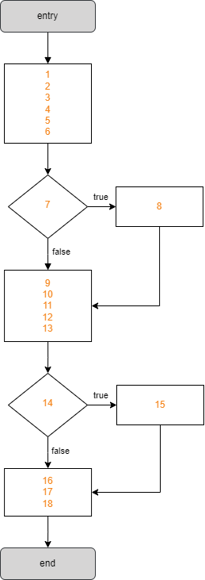
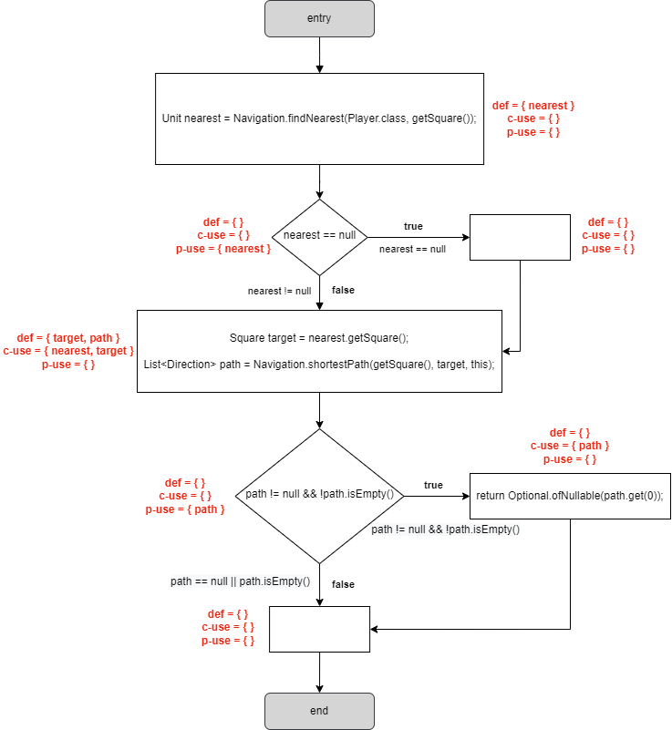
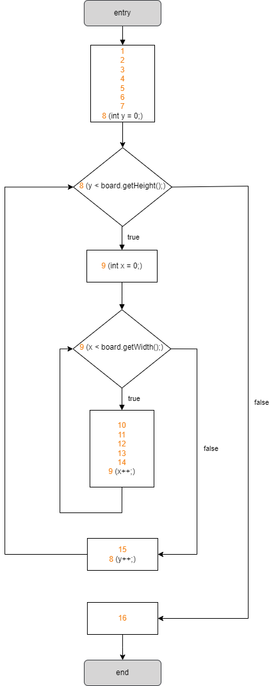
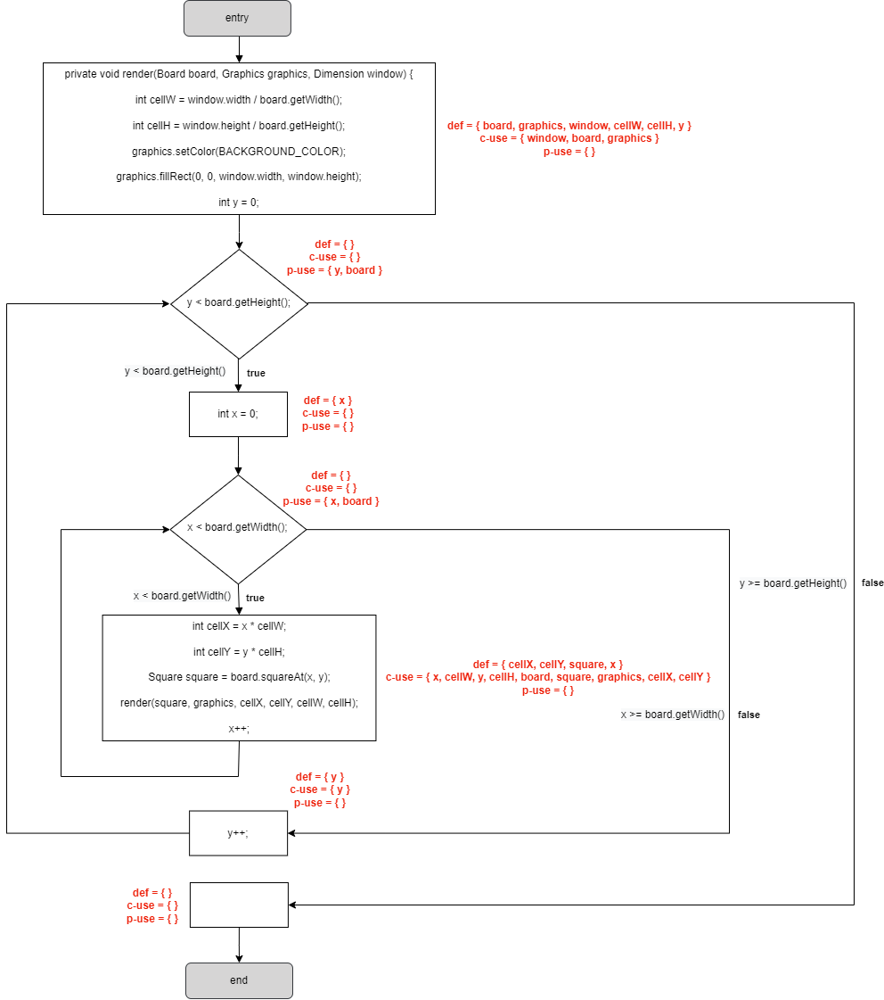

# Dataflow Testing

## 1. Dataflow Testing

### 1.1 nextAiMove function in the nl.tudelft.jpacman.npc.ghost.Blinky class

Numbering the lines of the `nextAiMove` method, we get:

```java
    @Override
1.  public Optional<Direction> nextAiMove() {
2.     assert hasSquare();
3. 
4.     // TODO Blinky should patrol his corner every once in a while
5.     // TODO Implement his actual behaviour instead of simply chasing.
6.     Unit nearest = Navigation.findNearest(Player.class, getSquare());
7.     if (nearest == null) {
8.         return Optional.empty();
9.     }
10.     assert nearest.hasSquare();
11.     Square target = nearest.getSquare();
12. 
13.     List<Direction> path = Navigation.shortestPath(getSquare(), target, this);
14.     if (path != null && !path.isEmpty()) {
15.         return Optional.ofNullable(path.get(0));
16.     }
17.     return Optional.empty();
18. }
```

The *Control-flow Graph* of this method is as follows:



In this case, the variables of interest are `nearest`, `target` and `path`.
After identifying and classifying the occurrences of all variables in the software under test (computing **defs**, **c-uses** and **p-uses** in each block), we are faced with the following *def-use graph*:



The **def-use pairs** identified for the variable `nearest` are:

| pair id | def |  use  |           path          |
|:-------:|:---:|:-----:|:-----------------------:|
|    1    |  6  |   11  |     <6,7,8,9,10,11>     |
|    2    |  6  |   11  |      <6,7,9,10,11>      |
|    3    |  6  | (7,T) |         <6,7,8>         |
|    4    |  6  | (7,F) |         <6,7,9>         |

The **def-use pairs** identified for the variable `target` are:

| pair id | def | use |    path    |
|:-------:|:---:|:---:|:----------:|
|    1    |  11 |  13 | <11,12,13> |

The **def-use pairs** identified for the variable `path` are:

| pair id | def |   use  |    path    |
|:-------:|:---:|:------:|:----------:|
|    1    |  13 |   15   | <13,14,15> |
|    2    |  13 | (14,T) | <13,14,15> |
|    3    |  13 | (14,F) | <13,14,16> |

**All-defs** coverage is achieved as there is at least one def-clear path from every definition of each variable to at least one c-use or p-use of each variable.
To satisfy the **all-defs** criteria, we must test, for example, the paths in the following pairs:

| **variable** | `nearest` | `target` | `path` |
|:------------:|:---------:|:--------:|:------:|
| **pair ids** |     2     |     1    |    1   |

**All-c-uses** coverage is achieved when, for every program variable, at least one **def-clear path** from every definition of that variable to every **c-use** of it must be covered.
To satisfy the **all-c-uses** criteria, we must test, for example, the paths in the following pairs:

| **variable** | `nearest` | `target` | `path` |
|:------------:|:---------:|:--------:|:------:|
| **pair ids** |     2     |     1    |    1   |

**All-p-uses** coverage is achieved when, for every program variable, at least one **def-clear path** from every definition of that variable to every **p-use** of it must be covered.
To satisfy the **all-p-uses** criteria, we must test, for example, the paths in the following pairs:

| **variable** | `nearest` | `target` | `path` |
|:------------:|:---------:|:--------:|:------:|
| **pair ids** |    3,4    |     -    |   2,3  |

**All-uses** coverage is achieved when, for every program variable, at least one **def-clear path** from every definition of that variable to every **c-use** and every **p-use** (including all outgoing edges of the predicate statement) of it must be covered.
Requires that all def-use pairs are covered.
To satisfy the **all-uses** criteria, we must test, for example, the paths in the following pairs:

| **variable** | `nearest` | `target` | `path` |
|:------------:|:---------:|:--------:|:------:|
| **pair ids** |   2,3,4   |     1    |  1,2,3 |

### 1.2 render function in the nl.tudelft.jpacman.ui.BoardPanel class

Numbering the lines of the `render` method, we get:

```java
1. private void render(Board board, Graphics graphics, Dimension window) {
2.     int cellW = window.width / board.getWidth();
3.     int cellH = window.height / board.getHeight();
4. 
5.     graphics.setColor(BACKGROUND_COLOR);
6.     graphics.fillRect(0, 0, window.width, window.height);
7. 
8.     for (int y = 0; y < board.getHeight(); y++) {
9.         for (int x = 0; x < board.getWidth(); x++) {
10.             int cellX = x * cellW;
11.             int cellY = y * cellH;
12.             Square square = board.squareAt(x, y);
13.             render(square, graphics, cellX, cellY, cellW, cellH);
14.         }
15.     }
16. }
```

The *Control-flow Graph* of this method is as follows:



In this case, the variables of interest are `board`, `graphics`, `window`, `cellW`, `cellH`, `y`, `x`, `cellX`, `cellY` and `square`.
After identifying and classifying the occurrences of all variables in the software under test (computing **defs**, **c-uses** and **p-uses** in each block), we are faced with the following *def-use graph*:



The **def-use pairs** identified for the variable `board` are:

| pair id | def |  use  |             path             |
|:-------:|:---:|:-----:|:----------------------------:|
|    1    |  1  |   2   |             <1,2>            |
|    2    |  1  |   3   |            <1,2,3>           |
|    3    |  1  |   12  | <1,2,3,4,5,6,7,8,9,10,11,12> |
|    4    |  1  | (8,T) |      <1,2,3,4,5,6,7,8,9>     |
|    5    |  1  | (8,F) |     <1,2,3,4,5,6,7,8,16>     |
|    6    |  1  | (9,T) |    <1,2,3,4,5,6,7,8,9,10>    |
|    7    |  1  | (9,F) |    <1,2,3,4,5,6,7,8,9,15>    |

The **def-use pairs** identified for the variable `graphics` are:

| pair id | def | use |               path              |
|:-------:|:---:|:---:|:-------------------------------:|
|    1    |  1  |  5  |           <1,2,3,4,5>           |
|    2    |  1  |  6  |          <1,2,3,4,5,6>          |
|    3    |  1  |  13 | <1,2,3,4,5,6,7,8,9,10,11,12,13> |

The **def-use pairs** identified for the variable `window` are:

| pair id | def | use |      path     |
|:-------:|:---:|:---:|:-------------:|
|    1    |  1  |  2  |     <1,2>     |
|    2    |  1  |  3  |    <1,2,3>    |
|    3    |  1  |  6  | <1,2,3,4,5,6> |

The **def-use pairs** identified for the variable `cellW` are:

| pair id | def | use |              path             |
|:-------:|:---:|:---:|:-----------------------------:|
|    1    |  2  |  10 |      <2,3,4,5,6,7,8,9,10>     |
|    2    |  2  |  13 | <2,3,4,5,6,7,8,9,10,11,12,13> |

The **def-use pairs** identified for the variable `cellH` are:

| pair id | def | use |             path            |
|:-------:|:---:|:---:|:---------------------------:|
|    1    |  3  |  11 |    <3,4,5,6,7,8,9,10,11>    |
|    2    |  3  |  13 | <3,4,5,6,7,8,9,10,11,12,13> |

The **def-use pairs** identified for the variable `y` are:

| pair id | def |  use  |      path      |
|:-------:|:---:|:-----:|:--------------:|
|    1    |  8  |   11  |   <8,9,10,11>  |
|    2    |  8  |   12  | <8,9,10,11,12> |
|    3    |  8  | (8,T) |      <8,9>     |
|    4    |  8  | (8,F) |     <8,16>     |
|    5    |  8  |   8   |       <8>      |

The **def-use pairs** identified for the variable `x` are:

| pair id | def |  use  |     path     |
|:-------:|:---:|:-----:|:------------:|
|    1    |  9  |   10  |    <9,10>    |
|    2    |  9  |   12  | <9,10,11,12> |
|    3    |  9  | (9,T) |    <9,10>    |
|    4    |  9  | (9,F) |    <9,15>    |
|    5    |  9  |   9   |      <9>     |

The **def-use pairs** identified for the variable `cellX` are:

| pair id | def | use |      path     |
|:-------:|:---:|:---:|:-------------:|
|    1    |  10 |  13 | <10,11,12,13> |

The **def-use pairs** identified for the variable `cellY` are:

| pair id | def | use |    path    |
|:-------:|:---:|:---:|:----------:|
|    1    |  11 |  13 | <11,12,13> |

The **def-use pairs** identified for the variable `square` are:

| pair id | def | use |   path  |
|:-------:|:---:|:---:|:-------:|
|    1    |  12 |  13 | <12,13> |

**All-defs** coverage is achieved as there is at least one def-clear path from every definition of each variable to at least one c-use or p-use of each variable.
To satisfy the **all-defs** criteria, we must test, for example, the paths in the following pairs:

| **variable** | `board` | `graphics` | `window` | `cellW` | `cellH` | `y` | `x` | `cellX` | `cellY` | `square` |
|:------------:|:-------:|:----------:|:--------:|:-------:|:-------:|:---:|:---:|:-------:|:-------:|:--------:|
| **pair ids** |    1    |      1     |     1    |    1    |    1    | 1,5 | 1,5 |    1    |    1    |     1    |

**All-c-uses** coverage is achieved when, for every program variable, at least one **def-clear path** from every definition of that variable to every **c-use** of it must be covered.
To satisfy the **all-c-uses** criteria, we must test, for example, the paths in the following pairs:

| **variable** | `board` | `graphics` | `window` | `cellW` | `cellH` |  `y`  |  `x`  | `cellX` | `cellY` | `square` |
|:------------:|:-------:|:----------:|:--------:|:-------:|:-------:|:-----:|:-----:|:-------:|:-------:|:--------:|
| **pair ids** |  1,2,3  |    1,2,3   |   1,2,3  |   1,2   |   1,2   | 1,2,5 | 1,2,5 |    1    |    1    |     1    |

**All-p-uses** coverage is achieved when, for every program variable, at least one **def-clear path** from every definition of that variable to every **p-use** of it must be covered.
To satisfy the **all-p-uses** criteria, we must test, for example, the paths in the following pairs:

| **variable** | `board` | `graphics` | `window` | `cellW` | `cellH` | `y` | `x` | `cellX` | `cellY` | `square` |
|:------------:|:-------:|:----------:|:--------:|:-------:|:-------:|:---:|:---:|:-------:|:-------:|:--------:|
| **pair ids** | 4,5,6,7 |      -     |     -    |    -    |    -    | 3,4 | 3,4 |    -    |    -    |     -    |

**All-uses** coverage is achieved when, for every program variable, at least one **def-clear path** from every definition of that variable to every **c-use** and every **p-use** (including all outgoing edges of the predicate statement) of it must be covered.
Requires that all def-use pairs are covered.
To satisfy the **all-uses** criteria, we must test, for example, the paths in the following pairs:

| **variable** |    `board`    | `graphics` | `window` | `cellW` | `cellH` |    `y`    |    `x`    | `cellX` | `cellY` | `square` |
|:------------:|:-------------:|:----------:|:--------:|:-------:|:-------:|:---------:|:---------:|:-------:|:-------:|:--------:|
| **pair ids** | 1,2,3,4,5,6,7 |    1,2,3   |   1,2,3  |   1,2   |   1,2   | 1,2,3,4,5 | 1,2,3,4,5 |    1    |    1    |     1    |

## 2. Unit Tests

The unit tests developed for the tests derived using *Dataflow Testing* are in the `BlinkyTest` and `BoardPanelTest` files.