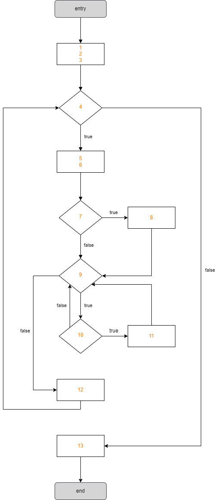

# Structural Testing (Line and Decision coverage)

### 1. Line coverage

I chose to apply *Line Coverage* to the `Player` class. The tests developed can be found in the `PlayerTest` file, having resulted in 100% line coverage.

### 2. Branch coverage

I chose to apply *Branch Coverage* to the `MapParser` class. The tests developed can be found in the `MapParserTest` file, resulting in 100% branch coverage.

### 3. Cyclomatic Complexity

Numbering the lines of the `getInheritance` method, we get:

```java
1.  List<Class<? extends Unit>> found = new ArrayList<>();
2.  found.add(clazz);

3.  int index = 0;
4.  while (found.size() > index) {
5.    Class<?> current = found.get(index);
6.    Class<?> superClass = current.getSuperclass();
7.    if (superClass != null && Unit.class.isAssignableFrom(superClass)) {
8.      found.add((Class<? extends Unit>) superClass);
      }
9.    for (Class<?> classInterface : current.getInterfaces()) {
10.     if (Unit.class.isAssignableFrom(classInterface)) {
11.       found.add((Class<? extends Unit>) classInterface);
        }
      }
12.   index++;
    }

13. return found;
```

The *Control-flow Graph* of this method is as follows:



Since this method is a structured function (it only has a single exit point/return statement), its CC can be calculated by:

`CC = E - N + 2P` (E = number of edges; N = number of nodes; P = number of connected components/graphs)

In this case, there are 15 edges, 12 nodes (10 normal, 1 entry and 1 end), and 1 graph (as it is a single function), so:

`CC = 15 - 12 + 2*1 = 5`

Therefore, there are 5 independent paths:

- **path 1**: 1, 2, 3, 4, 13
- **path 2**: 1, 2, 3, 4, 5, 6, 7, 9, 12, 4, 13
- **path 3**: 1, 2, 3, 4, 5, 6, 7, 8, 9, 12, 4, 13
- **path 4**: 1, 2, 3, 4, 5, 6, 7, 9, 10, 9, 12, 4, 13
- **path 5**: 1, 2, 3, 4, 5, 6, 7, 9, 10, 11, 9, 12, 4, 13

Some unit tests for these paths are in the `CollisionInteractionMapTest` file.