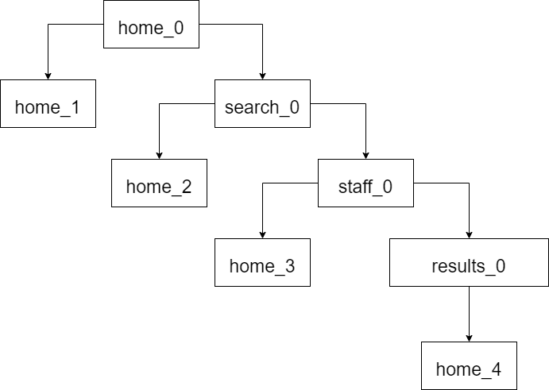

# 1. Model-based Testing

### 1.1 State Machine

There are:
- 4 states
- 8 transitions
- 4 events

### 1.2 Transition Tree

There are 5 different paths.

### 1.3 Transition Table

There are:
- 8 normal paths
- 8 sneaky paths

### 1.4 QF-Test exercise

For this exercise, I chose the use case of the [FEUP's webpage](https://sigarra.up.pt/feup/en/WEB_PAGE.INICIAL) "Search for a staff member by their name".

1) The **State Machine** diagram for this use case is depicted in the following image.

2) The **Transition Tree** diagram for this use case is depicted in the following image.

3) The **Transition Table** for this use case is depicted in the following image.

4) Looking at the **Transition Tree**, we can derive 4 test cases, where each corresponds to a path from the root of the tree to one of the leaves.

5) The sneak path chosen to be tested consists of going directly from the Home page to the Staff page. This path is actually possible since there is a Staff button on the Home page that leads us directly to the Search Staff page.

6) All these tests were implemented using the ***QF-Test*** tool and all of them pass, as shown in the following image.

