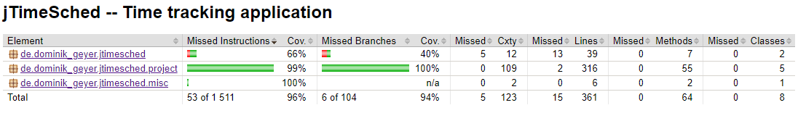

# Assignment 5 - Structural Testing: Line and Decision coverage (White-box Testing)

*Structural Testing* is a white-box testing technique used to test the internal design of the software or the structure of the coding for the particular software.
*Code coverage* is a metric that can help you understand how much of your source code is tested.
Measurement of *structural coverage* of code is an objective means of assessing the thoroughness of testing.
There are various industry-standard metrics available for measuring structural coverage, but in this report, we will explore only two of them:
- *Line Coverage*: how many lines of source code have been tested
- *Branch Coverage*: how many of the branches of the control structures (if statements, for instance) have been executed

To analyze the depth of our unit tests, we used the **JaCoCo** tool, a code coverage reports generator for **Java** projects.
The first step we took was to assess the coverage resulting from tests developed for previous assignments.
To configure this tool in our project, we had to modify the `pom.xml` file by adding the *JaCoCo* and *Surefire* plugins.

After a first analysis of the coverage of our tests, we developed more unit tests to get closer to 100% coverage (excluding GUI features).
So, we focused on the `project` and `misc` sub-packages in addition to testing the main class in the `jtimesched` package.

We developed each test with the desired coverage in mind and tried to make the most of **JUnit**'s features, which will be described in the second section.
As for the naming of test methods, we follow a *MethodName_StateUnderTest_ExpectedBehaviour* approach.

Finally, after reaching the desired depth, a final report on the project's coverage will be generated and discussed in the last section.

## 1) Initial Line and Branch Coverage

Since we performed black-box testing in previous assignments by developing some unit tests, we already had some coverage.
Therefore, we ran the tests and generated a **JaCoCo** report displaying the following coverage:


The report analyzes *line coverage* and *branch coverage*, displaying the number of lines, branches, classes and methods missed, as well as the percentage of coverage.
This analysis is done in each file and folder, allowing navigation between different folders by clicking them.
Also, if a file is selected instead, it is possible to visualize all the covered lines and branches, which results in a necessary functionality to help increase the coverage iteratively.
The previous image shows the project's total coverage in the *Total* column, which is located in the root directory.

After a better analysis, we concluded that the *de.dominik_geyer.jtimesched.gui* and *de.dominik_geyer.jtimesched.gui.table* directories were not worth testing since they were associated with the GUI.
Therefore, the `pom.xml` was changed to ignore those elements, resulting in the following report:


Therefore, the assignment's initial coverage contains:
- 39% *Line Coverage*
- 34% *Branch Coverage*

## 2) JUnit features

As stated before, we decided to just test the non-GUI related classes, that is, the ones in the packages:

- `misc`: functions that are required from lots of places in the code, in this case, related to date formatting
- `project`: main code with the program logic

Besides this, we also tested the main class, located in the `src` package.

This section describes the most relevant features of **JUnit** applied in our tests.

### Assertions

One of the leading testing goals is to compare the *expected value* to the *actual value* after code execution.
To perform this comparison, we used the following methods from the **JUnit** *Assertions* library:
- `static void assertTrue(boolean condition)`: asserts that the provided *condition* is true
- `static void assertFalse(boolean condition)`: asserts that the provided *condition* is false
- `static void assertEquals(Object Expected, Object Actual)`: asserts that *expected* and *actual* are equal (both arguments must be of the same type)
- `static void assertNull(Object actual)`: assert that the provided *actual* is null 
- `static <T extends Throwable> assertThrows(assertThrows(Class<T> expectedType, Executable executable)`: asserts that the execution of the supplied *executable* throws an exception of the expectedType and returns the exception
- `static void assertDoesNotThrow(Executable executable)`: assert that execution of the supplied *executable* does not throw any kind of exception
- `static void assertAll(Executable... executables)`: asserts that all supplied executables do not throw exceptions

#### 1) **assertTrue** && **assertFalse**
We used these methods when the evaluated result's variable type was **boolean**.

The following code segment shows a test containing an assertTrue to ensure a project runs after it has started.
It also contains two `assertFalse` statements to ensure that the project is not running when initialized or after issuing a command to pause it.

```java
@Test
public void testSetRunning_BooleanInput_ShouldChangeState() {
    Project proj = new Project();
    Assertions.assertFalse(proj.isRunning());
    proj.setRunning(true);
    Assertions.assertTrue(proj.isRunning());
    proj.setRunning(false);
    Assertions.assertFalse(proj.isRunning());
}
```

#### 2) **assertEquals**

We used this method when the value of two variables of non-boolean type was being compared. We could also use the `assertSame()` method to compare *primitives*, given that it uses the '==' operator instead of the *equals* method. For simplicity and to avoid unnecessary mistakes, we only used assertEquals.

For instance, the following code segment displays a test which evaluates the number of existing projects in the table, which is expected to be three (which were added in the **@BeforeEach** section).

```java
@Test
public void testGetRowCount_InputNumberOfProjects_ShouldBeThree() {
    assertEquals(3, tableModel.getRowCount());
}
```

#### 3) **assertNull**

We used this method once to ensure that the project title was correctly set to *null*, as shown in the example below.

``` java
@Test
public void testSetTitle_NullInput_ShouldSetTitleNull() {
    assertEquals("Test Project Before", proj.getTitle());
    proj.setTitle(null);
    assertNull(proj.getTitle());
}
```

#### 4) **assertThrows** && **assertDoesNotThrow**

The first method allowed testing code segments where a specific exception should be thrown, testing the code's behaviour in error scenarios. In **JUnit 5**, the version we're using, this method replaces the `@Test(expected = ...)` annotation from older versions.

For example, the following test uses the `assertThrows` method to ensure that a project that is not running raises a *ProjectException* when the `getElapsedSeconds` method is called.

```java
@Test
public void testGetElapsedSeconds_IdleProject_ShouldThrowException() {
    // Project should not be running before it is started
    assertFalse(proj.isRunning());
    assertThrows(ProjectException.class, proj::getElapsedSeconds);
}
```

The second method allowed testing code segments that do not throw any kind of exception, testing the handling of exceptions.

For example, the following test uses the `assertDoesNotThrow` method to ensure that no exception is raised when the `toggle` method is called, asserting that the *catch* block in that method works when handling an exception that happens upon starting the project.

```java
@Test
public void testToggle_UponException_ShouldCatchIt() throws ProjectException {
    assertFalse(proj.isRunning());

    doThrow(ProjectException.class).when(proj).start();

    assertDoesNotThrow(proj::toggle);
    assertFalse(proj.isRunning());
}
```

#### 5) **assertAll**

This method allows running the other *assertions* inside a single statement.
It always checks all of the assertions in the argument list, no matter how many fail.
This means that if at least one fails, a detailed result of all tests is prompted.
It is best used for asserting a test set of properties that belong together, such as the fields of a non-primitive object with no predefined *equals* and *hashCodes* methods.

For example, the following code segment shows a use case of the `assertAll` method, where all the fields of two *Project* variables are being compared.

```java
assertAll("Compare both Projects",
    () -> assertEquals(prj.getTitle(), returned.getTitle()),
    () -> assertEquals(prj.getNotes(), returned.getNotes()),
    () -> assertEquals(prj.getTimeCreated(), returned.getTimeCreated()),
    () -> assertEquals(prj.getSecondsToday(), returned.getSecondsToday()),
    () -> assertEquals(prj.getSecondsOverall(), returned.getSecondsOverall()),
    () -> assertEquals(prj.getQuotaOverall(), returned.getQuotaOverall()),
    () -> assertEquals(prj.getQuotaToday(), returned.getQuotaToday()),
    () -> assertEquals(prj.getTimeStart(), returned.getTimeStart()),
    () -> assertEquals(prj.getColor(), returned.getColor())
);
```

### JUnit Annotations

The section aims to identify and describe the **JUnit** annotations used in the assignment.
They are a unique form of syntactic meta-data that can be added to the test code for better readability and structure.
Annotations were introduced in **JUnit 4** and are still used in the current version (**JUnit 5**).


#### *@Test*
This annotation was used to indicate that the following code segment must be interpreted as a *Java* test.

Example:

```java
@Test
public void testGetSecondsToday_IdleProject_ShouldReturnSeconds() {
    assertFalse(proj.isRunning());
    assertEquals(10, proj.getSecondsToday());
}
```

#### *@BeforeEach*
This annotation was used to run a code segment before every test within the same scope.

Example:

```java
@BeforeEach
void setup() {
    proj = new Project("Test Project Before");
}
```

#### *@Nested*
This annotation was used to form logical groups of test cases while also improving the organization of big test classes.
It can be combined with **@BeforeEach** to run a code segment before a group of tests.
In our case, grouping tests about a single method helped keep the test files clean and easy to read.

Example:

```java
@Nested
public class SetTitleTest {
    private Project proj;

    @BeforeEach
    void setup() {
        (...)
    }

    @Test
    public void testSetTitle_UponCall_ShouldChangeTitle() {
        (...)
    }

    @Test
    public void testSetTitle_NullInput_ShouldSetTitleNull() {
        (...)
    }
}
```

#### *@ParameterizedTest*

This annotation enables executing a single test method multiple times with different parameters.
It replaces `@Test` and can be combined with the following annotations:
- `@ValueSource` - Enables the specification of a single array of literal values and can only be used for providing a single argument per parametrized test invocation
- `@CsvSource` - Expresses arguments lists as comma-separated values
- `@MethodSource`- Used to match an existing method, of type `static Stream<Arguments>`, to allow passing complex objects as arguments (Example in the **@TestInstance** section).

This annotation also contains an argument `name`, which allows having a name displayed on the *Debug Console* after execution.
Also, the index of the parametrized test can be passed, as well as its arguments, providing a distinction between each test instance to improve readability, which is shown in the following code segment:

Example:

```java
@ParameterizedTest(name = "Test #{index} with Positive input {arguments}")
@ValueSource(ints = {1,10,60,120})
public void testSetSecondsOverall_PositiveInput_ShouldUpdateSeconds(int seconds) {
    assertEquals(0, proj.getSecondsOverall());
    proj.setSecondsOverall(seconds);
    assertEquals(seconds, proj.getSecondsOverall());
}

```

After Running:


#### *@TestInstance*

This annotation was combined with **@ParametrizedTest** and **@MethodSource**, allowing the creation of a method containing a stream of arguments with complex objects.

Example:

```java
@TestInstance(TestInstance.Lifecycle.PER_CLASS)
@Nested
public class GetColumnClassTest {
    Stream<Arguments> arguments() {
        return Stream.of(
            Arguments.of(COLUMN_COLOR, Color.class),
            Arguments.of(COLUMN_CREATED, Date.class),
            Arguments.of(COLUMN_TIMEOVERALL, Integer.class),
            Arguments.of(COLUMN_TIMETODAY, Integer.class),
            Arguments.of(COLUMN_CHECK, Boolean.class),
            Arguments.of(COLUMN_ACTION_DELETE, Boolean.class),
            Arguments.of(COLUMN_ACTION_STARTPAUSE, Boolean.class),
            Arguments.of(10, String.class)

        );
    }

    @ParameterizedTest
    @MethodSource("arguments")
    public void testGetColumnClass_ColumnInput_ShouldReturnClass(int column, Class cl) {
        assertEquals(cl, tableModel.getColumnClass(column));
    }
}
```

In this case, the annotation is necessary to invoke a non-static method, `arguments()`, inside a **@Nested** class that doesn't allow static methods.
The **@MethodSource("arguments")** annotation calls the method `arguments()` that provides a list of `Class` objects, which could not be passed through the *@CsvSource* annotation.

#### *@DisplayName*

Provides a name to the test, improving readability while debugging.

Example:

```java
@Test
@DisplayName("Test with null input throws exception")
public void testParseSeconds_NullInput_ShouldThrowException() {
    assertThrows(NullPointerException.class, () -> parseSeconds(null));
}
```

### Spy Objects

Additionally, to test situations that never happen in the normal course of the program, we were tempted to modify the behaviour of some methods to test these extreme cases.
For this, we had to configure **Mockito** in the `pom.xml` file, adding its dependency, and we used the `spy` method to create spy objects of our classes.
Spy objects allow us to call all the normal methods of the object while still tracking every interaction, being able to modify the behaviour of only some of its methods.

In the following example, we create a spy object of our `Project` class and modify the behaviour of its `getElapsedSeconds` method, ensuring that an exception occurs upon its call.
This allows us to test a situation that never happens in the normal flow of the programs, achieving coverage in these "occult" areas.

Example:

```java
@BeforeEach
void setup() {
    proj = spy(Project.class);
    proj.setSecondsToday(10);
}

(...)

@Test
public void testGetSecondsToday_ElapsedSecondsOnIdleProject_ShouldCatchException() throws ProjectException {
    assertFalse(proj.isRunning());
    proj.start();
    assertTrue(proj.isRunning());

    doThrow(ProjectException.class).when(proj).getElapsedSeconds();

    assertDoesNotThrow(proj::getSecondsToday);
    assertEquals(10, proj.getSecondsToday());
}
```

## 3) Final Line and Branch Coverage

After performing extensive testing, we ended up with the following code coverage:



Therefore, we were able to improve:
- *Line Coverage* from 39% to 96%
- *Branch Coverage* from 34% to 94%

After extensive testing, we reached test coverage values above 90%, as desired, making the *JTimeSched* program more robust and error-free.
It also improved the traceability of future errors that might be unintentionally generated when implementing new features.

-----

## Group 10

- Hugo Guimarães, up201806490
- Paulo Ribeiro, up201806505

## Sources

- [Class Slides - Prof. José Campos](https://paginas.fe.up.pt/~jcmc/tvvs/2022-2023/lectures/lecture-5.pdf)
- [Structural (Code) Coverage - QA Systems](https://www.qa-systems.com/blog/what-is-meant-by-structural-code-coverage/)
- [Coverage Counters - JaCoCo](https://www.eclemma.org/jacoco/trunk/doc/counters.html)
- [Parametrized Tests - Baeldung](https://www.baeldung.com/parameterized-tests-junit-5)
- [Mockito Spy - Baeldung](https://www.baeldung.com/mockito-spy)
- [JUnit User Guide - JUnit](https://junit.org/junit5/docs/current/user-guide)
- [JUnit Assertions - JUnit](https://junit.org/junit5/docs/5.0.1/api/org/junit/jupiter/api/Assertions.html)
- [JUnit Annotations - JUnit](https://www.baeldung.com/junit-testinstance-annotation)