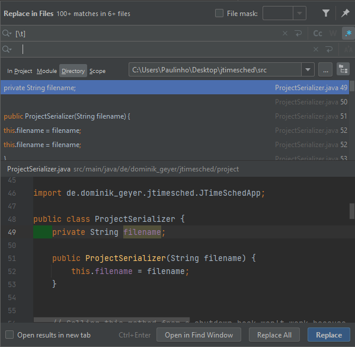

# Assignment 1 - Static Testing

## Project Description

The *jTimeSched* project consists of a simple and lightweight time tracking tool, through a lean but extremely intuitive GUI.
The program allows the user to track elapsed time for tasks and projects and use the data for the recording of time worked.

It's possible to create or delete a task/project at any time.
For each task/project, the program displays its title, creation date, total time spent and time spent on the current day, all these parameters being manually editable by the user.
In addition, each item also has an associated checkbox that allows us to mark completed tasks/projects, a colour that allows us to mark similar projects, for example, and a button that starts/stops counting the time for that item.
The program allows the user to sort items in ascending or descending order based on each of these properties.

The GUI also displays the total number of tasks/projects, the overall time spent on them, and the total time spent on the current day.
There is also an input field that allows the user to highlight items based on textual search.
Finally, the interface presents a log of the events that occurred in the current session, recording, for example, changes in items and activations/deactivations in the times of each task/project.

The image below depicts an example of using this project.


The project consists of the following directories:

- `assets` - content related to the program icon
- `assignments` - folder that will store our assignments along the course
- `conf` - content stored by the program, with all the information about the tasks/projects
- `dist` - content related to the distribution of the program
- `launcher` - contains the project executables
- `rulesets` - folder with the set of rules defined for the testing tools
- `src` - contains the source code of the project, including the main class *JTimeSchedApp*
  - `gui` - code related to the program interface
  - `misc` - functions that are required from lots of places in the code, in this case, related to date formatting.
  - `project` - main code with the program logic
- `target` - generated files upon build, including the reports of the testing tools

## Static Testing

Static Testing is a software testing technique, used to check defects in software applications without executing the code.
It is concerned with the analysis of the static system representation (source code, documents, models, prototypes, etc.) to discover faults.

The two main types of static testing techniques are:
  - **manual examinations**: include analysis of code done manually, also known as reviews
  - **automated analysis**: static analysis done using tools

Some main reasons to perform static testing are:
  - Early defect detection and correction
  - Reduced testing cost and time, as it is easier to identify and solve errors at an early stage of development
  - Improved maintainability of code and design, by enforcing formalized coding standards
  - Detection of dependencies and inconsistencies in software, whose arrangement reduces the number of defects found later in the process

## Tools, Reports and Bugs

For this first assignment, we chose to use [Checkstyle](https://checkstyle.sourceforge.io/) and [Spotbugs](https://spotbugs.github.io/) as tools to detect and fix bugs in the source code.
For each of these tools, we present its description, configuration, a summary of the report produced by them, five discovered bugs and our solution to fix them.

### Checkstyle


#### Description

// TODO

#### Configuration

// TODO

braceAdjustment indentation from 2 to 0

#### Report

// TODO: 

#### Bugs Found

1. 




This bug caused a plentiful amount of warnings related to tabs being used instead of empty spaces.
By fixing this issue, we reduced the amount of warnings from 4150 to 611 (then 603 after lowering the bracket indentation from 2 to 0).

File -> Settings -> Code Style -> Java -> Use Tab off
CTRL + SHIFT + R -> using Regex, replace [\t] by four empty spaces, only in the `src` directory

2.


File -> Settings -> Code Style -> Java -> Brace Adjustement all options to End of line
Then, right click on the `src` directory and click "Reformat Code", to apply settings to ...
Tinha 4 bugs deste tipo.
Dizer que Reformat Code até eliminou mais warnings do que o esperado, relacionados com linhas vazias

Before:
```java
public static String getAppVersion()
    {
        String appVersion = Package.getPackage("de.dominik_geyer.jtimesched").getImplementationVersion();
        return (appVersion != null) ? appVersion : "unknown";
    }
```

After:
```java
public static String getAppVersion() {
        String appVersion = Package.getPackage("de.dominik_geyer.jtimesched").getImplementationVersion();
        return (appVersion != null) ? appVersion : "unknown";
    }
```

3.


Procuramos formas de corrigir o problema de uma só vez, mas após não encontrarmos soluções, acabamos por corrigir manualmente, já que eram apenas 7 situações no código.

Before:
```java
if (button == MouseEvent.BUTTON1) {    // left button
    switch (column) {
        case ProjectTableModel.COLUMN_ACTION_DELETE:
            if (e.getClickCount() == 2)
                handleDelete(tstm, prj, row);
            break;
        case ProjectTableModel.COLUMN_ACTION_STARTPAUSE:
            handleStartPause(prj);
            break;
    }
}
```

After:
```java
if (button == MouseEvent.BUTTON1) {    // left button
    switch (column) {
        case ProjectTableModel.COLUMN_ACTION_DELETE:
            {...}
        case ProjectTableModel.COLUMN_ACTION_STARTPAUSE:
            {...}
        default:
            throw new IllegalStateException("Unexpected value: " + column);
    }
}
```

4.

5.

#### Bugs Fixes

### SpotBugs

#### Description

// TODO

#### Configuration

// TODO

#### Report

// TODO

#### Bugs Found

#### Bug Fixes

-----

#### Group 10

- Hugo Guimarães, up201806490
- Paulo Ribeiro, up201806505

#### Sources

- [Class Slides - Prof. José Campos](https://paginas.fe.up.pt/~jcmc/tvvs/2022-2023/recitations/recitation-1.pdf)
- [What is Static Testing? What is a Testing Review? - Guru99](https://www.guru99.com/testing-review.html)