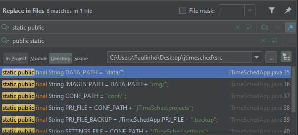

# Assignment 1 - Static Testing

## Project Description

The *jTimeSched* project consists of a simple and lightweight time tracking tool, through a lean but extremely intuitive GUI.
The program allows the user to track elapsed time for tasks and projects and use the data for the recording of time worked.

It's possible to create or delete a task/project at any time.
For each task/project, the program displays its title, creation date, total time spent and time spent on the current day, all these parameters being manually editable by the user.
In addition, each item also has an associated checkbox that allows us to mark completed tasks/projects, a colour that allows us to mark similar projects, for example, and a button that starts/stops counting the time for that item.
The program allows the user to sort items in ascending or descending order based on each of these properties.

The GUI also displays the total number of tasks/projects, the overall time spent on them, and the total time spent on the current day.
There is also an input field that allows the user to highlight items based on textual search.
Finally, the interface presents a log of the events that occurred in the current session, recording, for example, changes in items and activations/deactivations in the times of each task/project.

The image below depicts an example of using this project.


The project consists of the following directories:

- `assets` - content related to the program icon
- `assignments` - folder that will store our assignments along the course
- `conf` - content stored by the program, with all the information about the tasks/projects
- `dist` - content related to the distribution of the program
- `launcher` - contains the project executables
- `rulesets` - folder with the set of rules defined for the testing tools
- `src` - contains the source code of the project, including the main class *JTimeSchedApp*
  - `gui` - code related to the program interface
  - `misc` - functions that are required from lots of places in the code, in this case, related to date formatting.
  - `project` - main code with the program logic
- `target` - generated files upon build, including the reports of the testing tools

## Static Testing

Static Testing is a software testing technique, used to check defects in software applications without executing the code.
It is concerned with the analysis of the static system representation (source code, documents, models, prototypes, etc.) to discover faults.

The two main types of static testing techniques are:
  - **manual examinations**: include analysis of code done manually, also known as reviews
  - **automated analysis**: static analysis done using tools

Some main reasons to perform static testing are:
  - Early defect detection and correction
  - Reduced testing cost and time, as it is easier to identify and solve errors at an early stage of development
  - Improved maintainability of code and design, by enforcing formalized coding standards
  - Detection of dependencies and inconsistencies in software, whose arrangement reduces the number of defects found later in the process

## Tools, Reports and Bugs

For this first assignment, we chose to use [Checkstyle](https://checkstyle.sourceforge.io/) and [Spotbugs](https://spotbugs.github.io/) as tools to detect and fix bugs in the source code.
For each of these tools, we present its description, configuration, a summary of the report produced by them, five discovered bugs and our solution to fix them.

### Checkstyle

#### Description

Checkstyle is a development tool to help write **Java** code that adheres to a coding standard. It automates the verification of Java code to spare humans from this tedious (but fundamental) task.
It can check many aspects of your source code, namely class or method design problems, code layout and formatting issues.

#### Configuration

Since it is a very configurable tool, we decided to configure it according to the Google coding conventions from [Google Java Style](https://google.github.io/styleguide/javaguide.html).
Although, after analysing the project code, we modified some of those checks, namely:

- Changed the value of the property `braceAdjustment` of the module `Indentation`. This property specifies how far a brace should be indented when on the next line. We changed it from 2 to 0 since the source code presented no indentation on these cases and it is the default value according to [Checkstyle documentation](https://checkstyle.sourceforge.io/apidocs/com/puppycrawl/tools/checkstyle/checks/indentation/IndentationCheck.html). However, this modification became useless as soon as we fixed the bug number 2 (LeftCurly) by positioning the braces on the end of the line instead of the following line.
- Changed the value of the property `arrayInitIndent` of the module `Indentation`. This property specifies how far an array initialisation should be indented when on the next line. We changed it from 2 to 4 as it is the default value according to [Checkstyle documentation](https://checkstyle.sourceforge.io/apidocs/com/puppycrawl/tools/checkstyle/checks/indentation/IndentationCheck.html). This discarded some of the initial warnings.
- Changed the value of the property `max` of the module `LineLength`. This property specifies the maximum line length allowed. We changed it from 100 to 200 since the first value resulted in many warnings that did not make sense in our context. For example, it occurred in some comments whose line separation would not be advantageous.

#### Report

The initial report produced by Checkstyle identified 1450 warnings and 0 errors.
The file with the most warnings is `JTimeSchedFrame.java`, with 1557 found, and the rules with the most violations are `FileTabCharacter`, with 2275, and `Indentation`, with 1511. We decided to explore bugs of different categories, them being **whitespace**, **indentation**, **blocks**, **coding**, **imports** and **modifier**.


#### Bugs & Fixes

The following section presents some of the explored bugs and the solutions we came up with to fix them. Notice that we avoided solving problems manually on a case-by-case basis, always trying to find automated ways to solve them using the IntelliJ IDE's potential.
This way, fixing similar bugs becomes much faster, approaching real-life contexts.

**1. *FileTabCharacter* (whitespace) & *Indentation* (indentation)**


We noticed that these two bugs were always associated and, since they constituted the majority of the warnings accused, we decided to solve them first.
FileTabCharacter simply says that there should be no tab characters ('\t') in the source code, whereas Indentation highlights violations of the correct indentation of Java code.

First, we configured the IDE to not use the tab character with `File -> Settings -> Code Style -> Java -> Use Tab character off`, leaving those configurations as the following image shows.


These configurations also fixed some other indentation warnings, like *arrayInitIndent*.

Then, we got rid of all the tab characters by replacing every tab with four whitespaces, with `CTRL + SHIFT + R -> using Regex, replace [\t] by four empty spaces`, only in the `src` directory, and then click `Replace All`.


By fixing these issues, we drastically reduced the number of warnings from 4150 to 603, as we can see in the following image.


**2. *LeftCurly* (blocks)**


This bug accused four violations of the placement of left curly braces (`{`) for code blocks, which should be placed at the end of the line with the function signature.

To fix that, we first changed the IntelliJ's configuration of the braces placement by going to the menu `File -> Settings -> Code Style -> Java -> Wrapping and Braces -> Braces placement` and setting all options to `End of line`, as the following image shows.


Then, to actually apply those settings, right-click on the `src` directory and click `Reformat Code`. This procedure by the IntelliJ IDE changes the code according to the requirements specified, and it even eliminated more warnings than expected, related to empty lines.

Before:
```java
  public static String getAppVersion()
      {
          String appVersion = Package.getPackage("de.dominik_geyer.jtimesched").getImplementationVersion();
          return (appVersion != null) ? appVersion : "unknown";
      }
```

After:
```java
  public static String getAppVersion() {
          String appVersion = Package.getPackage("de.dominik_geyer.jtimesched").getImplementationVersion();
          return (appVersion != null) ? appVersion : "unknown";
      }
```

This procedure reduced the number of warnings from 603 to 321, as we can see in the following image.


**3. *MissingSwitchDefault* (coding)**


This bug, a control-flow problem, results from a clause that checks that every switch statement has a default clause.

As for the other bugs, we searched for ways to fix the problem automatically at once, but after not finding any solutions, we ended up fixing it manually, as there were only seven situations in the code.

Before:
```java
  if (button == MouseEvent.BUTTON1) {    // left button
      switch (column) {
          case ProjectTableModel.COLUMN_ACTION_DELETE:
              if (e.getClickCount() == 2)
                  handleDelete(tstm, prj, row);
              break;
          case ProjectTableModel.COLUMN_ACTION_STARTPAUSE:
              handleStartPause(prj);
              break;
      }
  }
```

After:
```java
  if (button == MouseEvent.BUTTON1) {    // left button
      switch (column) {
          case ProjectTableModel.COLUMN_ACTION_DELETE:
              {...}
          case ProjectTableModel.COLUMN_ACTION_STARTPAUSE:
              {...}
          default:
              throw new IllegalStateException("Unexpected value: " + column);
      }
  }
```

As a result, these fixes reduced the number of warnings from 321 to 314.


**4. *CustomImportOrder* (imports) & *AvoidStarImport* (imports)**


This bug presents a variety of descriptions according to the warning at hand, but in general, it is related to the order of the import declarations or empty lines between some of them.

To solve the warnings related to the empty lines between imports, we headed to the menu `File -> Settings -> CodeStyle -> Java -> Imports` and in the section `Import Layout` we deleted the blank lines between the different imports, highlighted in the following image.


Then, to solve the bugs about the order of the imports, we started by analyzing the error descriptions, shown in the next figure.


After this analysis, we configurated the `Import Layout` section by reordering the types of imports there. The following image shows the final order which fixed the remaining *CustomImportOrder* warnings.


We also noticed another bug of this category, the *AvoidStarImport* warning, that accuses import statements that use the `*` notation which may lead to tight coupling between packages or classes and might lead to problems when a new version of a library introduces name clashes. The following image shows occurrences of this type of bug.


To fix them, we erased every entry on the grid of the section `Packages to Use Import with '*'` and changed the values of the inputs `Class count to use import with '*'` and `Names count to use static import with '*'` to 500, a high enough value that guarantees that the `*` notation will never be used. The following image shows the final configuration of these menus.


After these changes, we must do the `Reformat Code` procedure previously explained to actually apply them to the code.

Upon generating a new report, we noticed that these fixes reduced the number of warnings from 314 to 159, as the following image shows.


**5. *ModifierOrder* (modifier)**


This bug happens when the order of the class modifiers differs from the suggestions in the [Java Language specification](https://docs.oracle.com/javase/specs/jls/se16/preview/specs/sealed-classes-jls.html). Having a standard order of the modifiers improves the code readability.

The nine occurrences of this warning consisted of a wrong order of the modifiers `static`/`public` and `static`/`private`.

As we just needed to swap these modifiers, these issues could be easily fixed by using the IntelliJ replace command `CTRL + SHIFT + R` on the entire `src` directory, as the following image shows.



Before:
```java
  static public final String LOG_FILE = CONF_PATH + "jTimeSched.log";
  static private Logger LOGGER;
```

After:
```java
  public static final String LOG_FILE = CONF_PATH + "jTimeSched.log";
  private static Logger LOGGER;
```

## SpotBugs

#### Description
SpotBugs is a program which uses static analysis to look for bugs in Java code, which checks more than 400 bug patterns with thoroughly documented descriptions.

#### Configuration
Não sei propriamente o que dizer aqui, dado que não fizemos assim grandes alterações de configurações.
(Achas relevante falar sobre o facto de termos que adicionar os plugins e de termos experimentado utilizar as configruações de remover um falso positivo ou de alterar a ordem de prioridades?)

> TODO

#### Report

The Spotbugs error fixes were only done after fixing the Checkstyle bugs.
Given that the amount of Spotbugs warnings was reduced after applying the Checkstyle fixes, we can conclude that both tools had some errors in common.

Therefore, when we first ran the program, it contained 25 bugs among 40 classes, which is shown in the following image


#### Bugs & Fixes

1.


This bug occurred only once and represented a violation for lacking the verification of the `mkdir()` method.

In the initial case shown bellow, it is only verified if the dirConf file is not a directory, which does not ensure that a subdirectory can be successfully created.

Before:
```java
  File dirConf = new File(JTimeSchedApp.CONF_PATH);
  if (!dirConf.isDirectory())
    dirConf.mkdir();
```

The way we fixed this problem was by making the method throw an exception in case the file fails to be created.

After:
```java
  File dirConf = new File(JTimeSchedApp.CONF_PATH);
  if (!dirConf.isDirectory())
    if (!dirConf.mkdir())
      throw new IOException("Unable to create path");
```
Therefore, after applying the aforementioned fix, the number of bugs was reduced to 24

> TODO: Verificar se isto está bem porque não sei se estamos tecnicamente a dar fix porque pode haver erros do diretório já existir quiepodem causar bosta e nos estamos só a lançar excepção
> Perguntar ao stor
2.


This vulnerability exposes a private variable, allowing someone from the outside to modify the instance unintentionally.
This can be fixed by creating a `Deep Copy` of the object.

To fix this issue, we replaced the getters and setters for the Date variables for Deep Copies.


Before:

```java
public Date getTimeStart() {
    return timeStart; 
}

```java
public void setTimeStart(Date timeStart) {
    this.timeStart = timeStart;
}
```

After:
```java
public Date getTimeStart() {
    return new Date(timeStart.getTime());
}
```

```java
public void setTimeStart(Date timeStart) {
    this.timeStart = new Date(timeStart.getTime());
}
```
This fix was done to 2 variables, timeStart and TimeCreated, which contained an error both in the getters and setters therefore we reduced the number of errors by 4, making the remaining error count 20.

> Source (https://stackoverflow.com/questions/18954873/malicious-code-vulnerability-may-expose-internal-representation-by-incorporati)

3.


The Spotbugs tool indicated that the JTimeSchedGUILogHandler could be turned into a static class, in order to improve performance.

This is achieved given that static classes when possible have two effects on improving performance:
- Fewer null checks because a static method invocation does not require a null check on the receiver
- Fewer allocations which lead to less memory pressure and time spent in GC (Garbage Collector).


Before:
```java
  class JTimeSchedGUILogHandler extends Handler {...}
```

After:
```java
  static class JTimeSchedGUILogHandler extends Handler {...}
```
This fixed reduced the number of errors from 20 to 19, slightly improving the program's performance.


> sources
> https://stackoverflow.com/questions/29595175/how-does-heavy-usage-of-static-classes-and-methods-offer-better-performance
> https://stackoverflow.com/questions/12279438/performance-of-static-methods-vs-instance-methods

4.


The `ProjectTable` class is a subclass of `JTable`.
In the initial code segment, it is assumed that an object from the parent class is in fact the `ProjectTable` class, which is done through a Type Cast which does not go through any verification.


Before:
```java
  ProjectTable pt = (ProjectTable) table;
  (...)
```

Therefore, a class verification should be added before the cast, to ensure it will succeed.

After:
```java
  if (table instanceof ProjectTable) {
    ProjectTable pt=(ProjectTable)table;
    (...)
  }
```

This fix now reduced the error count by 1, to 18.

> TODO: Nã deviamos dar launch a uma exception em caso de erro? Senão soma e segue sem nenhuma mensagem de erro :/

>source https://stackoverflow.com/questions/4862960/explicit-casting-from-super-class-to-subclass

5.


This bug was detected, given that there were `FileInputStreams` and `FileOutputStreams` that were not ensured to close.

Even though the initial code contained the methods for closing both streams, 

```java
    fis.close();
    fos.close();
```
There was no guarantee that these methods would be called, given that exceptions could ocurr in previous code segments after the streams being opened.

The was fixed by placing the streams' `read` and `write` methods inside a try catch statement, and placing the stream closing methods inside the finnally block, which ensures its execution in the presence of errors in the statement.

```java
finally {
    if (fis != null) {
        try {
            fis.close();
        } catch (IOException e) {
            e.printStackTrace();
        }
    }
    if (fos != null) {
        try {
            fos.close();
        } catch (IOException e) {
            e.printStackTrace();
        }
    }
```

Some null constraints were also required in case the streams were unsucessfully created.

This fix reduced the number of bugs by 2, reaching the final amount of 16 errors.


-----

#### Group 10

- Hugo Guimarães, up201806490
- Paulo Ribeiro, up201806505

#### Sources

- [Class Slides - Prof. José Campos](https://paginas.fe.up.pt/~jcmc/tvvs/2022-2023/recitations/recitation-1.pdf)
- [What is Static Testing? What is a Testing Review? - Guru99](https://www.guru99.com/testing-review.html)
- [Checkstyle](https://checkstyle.sourceforge.io/)
- [Bug Descriptions - SpotBugs](https://spotbugs.readthedocs.io/en/stable/bugDescriptions.html)