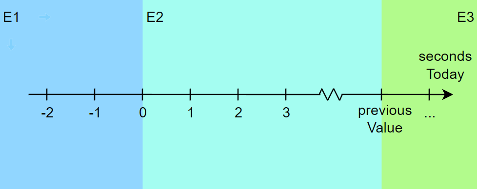
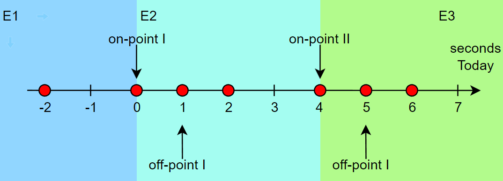

# Assignment 3 - Boundary Value Analysis (Black-box Testing)

### Introduction

TODO: definição de Boundary Value Analysis, introdução

Due to time and budget considerations, it is not possible to perform exhausting testing for each set of test data, especially when there is a large pool of input combinations.

*Boundary Value Analysis* is a testing technique used as an easy way to intelligently select from the pool test case, such that all test case scenarios are covered.

To try out this technique, we selected 3 out of the 5 functions from the 2nd Assignment.
For each one, we selected its previously defined partitions and performed a Boundary Value Analysis.

### Boundary Testing

TODO: Falar mais dos inpoints e offpoints?

*Boundary Testing* is a *Black-box* software testing technique where test cases utilize extreme ends or boundaries between partitions to test if they are valid.

The behaviour at the edge of the equivalence partition is more likely to be incorrect than the behaviour within the partition, therefore boundaries are in an area where testing is likely to yield more defects.

The basic idea in normal value testing is to select input variables as their:
1. Minimum value
1. Just above the minimum
1. A nominal value
1. Just bellow the maximum
1. Maximum value


### 1) `public void adjustSecondsToday(int secondsToday)`

#### Description

This function of the `Project` class is called whenever the user edits the `Time Today` table field, arising the need to adjust the value from the `Time Overall` variable accordingly.
This method evaluates the variations from the input values in comparison to the previously stored ones and makes the necessary adjustments to update the time variables.

(TODO: Explicar o pq de a escolhermos)

#### *Category-Partition* algorithm

1. This method has only one parameter:
    - `secondsToday`: an int representing the provided seconds in the table field.
1. For each parameter we define the characteristics as:
    - `secondsToday`: corresponds to the number of seconds of the user input variable
1. The number of characteristics and parameters is not too large in this case, so we don't need to be defining testable combinations of features.
   *Constraints*: negative values for the variable `secondsToday` are not allowed.
   Several combinations of values must be tested, such as a negative input from the seconds and different combinations of the `secondsToday` parameter being smaller or larger than the previous value of the `secondsToday` variable.
1. After thinking about the possible categories of inputs, we get the following tests:
    - `secondsToday` input is larger than its previous value
    - `secondsToday` input is smaller than its previous value
    - `secondsToday` input is negative

#### *Boundary Value Analysis*


Regarding the `secondsToday` variable, there are 3 possible partitions, where `previousValue` is the previous value of the `secondsToday` before method execution:

1. E1: `secondsToday` <= 0
1. E2: 0 < `secondsToday` < `previousValue` 
1. E3: 0 < `previousValue` <  `secondsToday`

Visually representing the partitions, we are faced with the following graphic:



The three chosen test cases corresponding to in-points of each partition are -2, 2 and 6.

Finally, the following image represents the tested input values for the `adjustSeconds` parameter, according to the tested situation (`previousValue` = 4)

- previousValue = 4
- On-Points: 0 and 4
- Off-Points: -1 and 5
- In-points: -2 , 2, and 4
TODO: Arranjar a forma de descrever esta imagem final de uma forma mais semelhante ás que o paulinho fez, apra ser consistente

#### Unit Tests

The tests implemented for this function can be found in the `ProjectTest.java` file, inside the test directory. We decided to create two test methods for different input values of the `secondsToday` parameter.

All tests have the following steps:
1. Creating a new `Project` variable
1. Setting the project's `secondsToday` variable to a specific value and `secondsOverall` variables to a specific value
1. Calling the `adjustSecondsToday` method with a specific value in its argument
1. Verifying the final values for the `secondsToday` and `secondsOverall` variables after the method has been called, expecting a predetermined output using the `assertEquals` method

Using the `@BeforeEach` annotation, we manage to perform the first 2 steps immediately before every single test. Therefore, the tests only differ on the values provided for steps 3 and 4.

We have decided to choose 4 as the previous value for the `secondsToday` variable before method call, which allows testing the borders as well as nominal values in the interval.
The `secondsOverall` variable is set to 50, which is simply a fixed value used to ensure the method performs its expected operations.

```java
public class adjustSecondsTodayTest {
    Project proj;
    
    @BeforeEach
    void setup() {
        proj = new Project("Test Project");

        proj.setSecondsToday(4);
        proj.setSecondsOverall(50);
    }

    // ... remaining tests ... 
}
```

In the first case, there are two categories being tested, either when:
1. The value initially set on the `secondsToday` variable before the method call is *smaller* than the given argument (Partition E2)
2. The value initially set on the `secondsToday` variable before the method call is *greater* than the given argument (Partition E3)

Both categories have two values being tested, the first being the closest off-point to the border, and the second being a nominal value in the provided interval.

This results, respectively, in:
1. An *increased* expected output of the `secondsOverall` variable after the method call;
2. A *lowered* expected output of the `secondsOverall` variable after the method call;


```java
@ParameterizedTest(name = "Test #{index} with Positive input {arguments}")
    @ValueSource(ints = {1,2,5,6})
    public void testAdjustSecondsToday_PositiveInput_ShouldReturnOverallTime(int value) {
        Project proj = new Project("Test Project");
        proj.setSecondsToday(4);
        proj.setSecondsOverall(50);
        proj.adjustSecondsToday(value);

        assertEquals(value,proj.getSecondsToday());
        assertEquals(50 + value - 4,proj.getSecondsOverall());
    } 
```

In the seconds and last case, the E1 partition is being tested, as the value initially set on the `secondsToday` variable is positive and the one provided in the method call is not positive. In the situation, the parameter is parsed as zero and the method updates the `secondsToday` and `secondsOverall` variables accordingly.

```java
@ParameterizedTest(name = "Test #{index} with Non Positive Input {arguments}")
    @ValueSource(ints = {-2,-1,0})
    public void testAdjustSecondsToday_NegativeInput_ShouldBecomeZero(int value) {

        proj.adjustSecondsToday(value);
        assertEquals(0,proj.getSecondsToday());
        assertEquals(50 - 4,proj.getSecondsOverall());
    }
```

All the tests above passed successfully, as expected.

TODO: Mudar o .png, eu tou a testar com o VSCode, convém ficar igual pelo intelIJ em todo o lado.


### 2) `public static int parseSeconds(String strTime) throws ParseException`

#### Description

This function of the `ProjectTime` class is called when the user edits the value of the "Time Overall" column, or the "Time Today" column of a given task/project, which correspond to the total time spent on that item, and the time spent on the current day, respectively.
This action can be performed directly on the table by double-clicking with the left mouse button on the respective field, or via an input window that opens after a right mouse click on the field.

Looking at its signature, we immediately deduced that it receives as input a string, coming from the user, and returns an int, which we believe is the total number of seconds taken by the task, due to the name of the function.
Therefore, its purpose would be to receive a time in a given string format and return the corresponding total number of seconds, to be able to update the table values accordingly.

That said, it is very important to test functions that receive user input, which we can never trust.
They can result in values in formats that are not the ones expected by the application, leading to its downfall.

After checking the format expected by the function (for this we had to resort to the source code, due to the lack of documentation), we thought of countless possibilities of inputs that could be categorized.
This possibility, together with the importance of robustness concerning user inputs, were the reasons why we chose this function.

#### *Category-Partition* algorithm

1. This method has only one parameter:
    - `strTime`: a string representing a given time

1. For each parameter we define the characteristics as:
    - `strTime`: corresponds to a time representation, in the format `h:m:s`, where `h`, `m` and `s` are the hours, minutes, and seconds of that time duration, respectively

1. The number of characteristics and parameters is not too large in this case, so we don't need to be defining testable combinations of features.
   *Constraints*: the string `strTime` must conform to the time format `(\d+):([0-5]?\d):([0-5]?\d)`, other variations are not allowed.
   Even in the case of following this format, it will be necessary to test certain values for the time units, such as invalid unit times like seconds exceeding the value 59 (must not be accepted) or units with leading zeros (should be accepted).

1. After thinking about the possible categories of inputs, we get the following tests:
    - `strTime` is null (**E1**)
    - `strTime` is not null and conforms to the time format (**E2**)
        - `strTime` duration is zero (**S1**)
        - `strTime` only has a zero value in the seconds time unit (**S2**)
        - `strTime` only has a zero value in the minutes time unit (**S3**)
        - `strTime` only has a zero value in the hours time unit (**S4**)
        - `strTime` duration is less than 24 hours (**S5**)
        - `strTime` duration exceeds 24 hours (**S6**)
        - `strTime` time units have leading zeros (**S7**)
    - `strTime` is not null, but doesn't conform to the time format (**E3**)
        - `strTime` is an empty string (**S8**)
        - `strTime` uses a separator character other than `:` (**S9**)
        - `strTime` uses more than two separators, to reference days, for example (**S10**)
        - `strTime` uses only one separator, when the time does not exceed one hour, for example (**S11**)
        - `strTime` doesn't use any separator, when the time does not exceed one minute, for example (**S12**)
        - the time unit minutes of `strTime` exceeds the value 59 (**S13**)
        - the time unit seconds of `strTime` exceeds the value 59 (**S14**)
        - some time unit of `strTime` contains a negative number (**S15**)
        - some time unit of `strTime` contains non-numeric characters (**S16**)

#### *Boundary Value Analysis*

For the three main partitions, we get the following in-points, on-points and off-points:
   - **E1**: the null value is both the in-point and on-point, and there are two off-points, each belonging to each of the other partitions (might be "0:0:0" and the empty string, for example)
   - **E2**: both the in-point and on-point could be any of the examples belonging to this partition, let us choose "0:0:0" and "4:21:16", and there are two off-points, each belonging to each of the other partitions (null and the empty string, for example)
   - **E3**: both the in-point and on-point could be any of the examples belonging to this partition, let us choose "8:-42:09" and the empty string, and there are two off-points, each belonging to each of the other partitions (null and "0:0:0", for example)

Accordingly, we will now define the test points for each of the sub-partitions.

   - **S1**: both in-point and on-point can be "0:0:0", and the two off-points can be null and the empty string, for example
   - **S2**: both in-point and on-point can be "12:15:0", and the two off-points can be null and the empty string, for example
   - **S3**: both in-point and on-point can be "7:0:9", and the two off-points can be null and the empty string, for example
   - **S4**: both in-point and on-point can be "0:17:05", and the two off-points can be null and the empty string, for example
   - **S5**: both in-point and on-point can be "20:02:0", and the two off-points can be null and the empty string, for example
   - **S6**: both in-point and on-point can be "59:59:59", and the two off-points can be null and the empty string, for example
   - **S7**: both in-point and on-point can be "06:09:03", and the two off-points can be null and the empty string, for example


   - **S8**: both in-point and on-point are the empty string, and the two off-points can be null and "0:0:0", for example
   - **S9**: both in-point and on-point can be "4.21.16", and the two off-points can be null and "4:21:16", for example
   - **S10**: both in-point and on-point can be "1:11:11:11", and the two off-points can be null and "59:59:59", for example
   - **S11**: both in-point and on-point can be "1:11", and the two off-points can be null and "0:0:0", for example
   - **S12**: both in-point and on-point can be "1", and the two off-points can be null and "0:0:0", for example
   - **S13**: both in-point and on-point can be "00:60:00", and the two off-points can be null and "18:59:14", for example
   - **S14**: both in-point and on-point can be "24:00:60", and the two off-points can be null and "9:21:59", for example
   - **S15**: both in-points and on-points can be "-2:13:09", "8:-42:09" or "07:5:-15", and the two off-points can be null and "06:09:03", for example
   - **S16**: both in-points and on-points can be "aa:19:23", "14:bb:34" or "04:25:cc", and the two off-points can be null and "0:17:05", for example

#### Unit Tests

The tests implemented for this function can be found in the `ProjectTimeTest.java` file, inside the `test` directory.
We decided to create two test methods, one for each super-category: the cases where `strTime` is null, where `strTime` conforms to the required format, and where it does not.

In the first case, the test just checks if the evaluated function throws an exception when it is called with a null parameter.

```java
@Test
@DisplayName("Test with null input throws exception")
public void testParseSeconds_NullInput_ShouldThrowException() {
  assertThrows(NullPointerException.class, () -> parseSeconds(null));
}
```

In the second case, the test just checks if the evaluated function returns the correct number of seconds for each input.
As we want to execute a single test method multiple times with different parameters, we must resort to a parameterized test.
We feed the function the various input-output pairs using the `@CsvSource` annotation.

```java
@ParameterizedTest(name = "Test #{index} with input {0} results in {1} seconds")
@CsvSource(value = {"0:0:0,0", "12:15:0,44100", "7:0:9,25209", "0:17:05,1025", "20:02:0,72120", "4:21:16,15676", "59:59:59,215999", "06:09:03,22143"})
public void testParseSeconds_CorrectDateFormat_ShouldReturnSeconds(String format, int value) throws ParseException {
  assertEquals(value, parseSeconds(format));
}
```

As for the third case, the test must check whether the execution of the evaluated function throws an exception of type *ParseException*, as suggested by the function signature.
Since we still need to execute a single test method multiple times with different parameters, we resorted to a parameterized test as well.
Bearing in mind that now we only need to pass a single value to the test function (there is no output as in the first case), we use the `@ValueSource` annotation to feed the function the invalid values of `strTime`.

```java
@ParameterizedTest(name = "Test #{index} with input {arguments} throws exception")
@ValueSource(strings = {"", "4.21.16", "1:11:11:11","1:11","1","00:60:00","24:00:60", "-2:13:09", "8:-42:09", "07:5:-15", "aa:19:23", "14:bb:34", "04:25:cc"})
public void testParseSeconds_IncorrectDateFormat_ShouldThrowException(String format) {
  assertThrows(ParseException.class, () -> parseSeconds(format));
}
```

Note that each of these test functions corresponds to one of the super-categories. The sub-partitions are tested in the functions relative to the corresponding super-categories, through the input values.
The chosen input values are intended to cover all test points that resulted from the *Boundary Value Analysis*.

All the tests above pass successfully, although we think that some cases where the input does not have two `:` separators, like "5:14", should be accepted.


### 3) `public boolean isCellEditable(int row, int column)`

#### Description

This function of the `isCellEditable` class is called when the user edits any column field from any project in the table, verifying if the user is allowed to edit the selected table cell.
We chose this function because of its importance in preventing the user from editing fields for which they do not have the proper permissions.
Furthermore, it receives two integers as parameters, to which we can apply *Boundary Value Analysis*, defining the ranges of valid rows and columns.

#### *Category-Partition* algorithm

1. This method has two parameters:
    - `row`: an integer value to select the table row to edit. This effectively selects which project the user wants to edit.
    - `column`: an integer value to select the table column to edit. This effectively selects which value of the project the user wishes to edit.

1. For each parameter we define the characteristics as:
    - `row`: must be an integer value lower or equal to the number of existing projects.
    - `column`: must be an integer value from 0 to 7, representing the project column the user wishes to edit.

   It represents the following constants:
   ```java
   public static final int COLUMN_ACTION_DELETE = 0;
   public static final int COLUMN_CHECK = 1;
   public static final int COLUMN_TITLE = 2;
   public static final int COLUMN_COLOR = 3;
   public static final int COLUMN_CREATED = 4;
   public static final int COLUMN_TIMEOVERALL = 5;
   public static final int COLUMN_TIMETODAY = 6;
   public static final int COLUMN_ACTION_STARTPAUSE = 7;
   ```

1. The number of characteristics and parameters is not too large in this case, so we don't need to be defining testable combinations of features.
   *Constraints*:
    - the integer `row` must be a non-negative value lower than the number of existing projects
    - the integer `column` must be a value between 0 and 7, according to the clickable columns in the interface

1. After thinking about the possible categories of inputs, we get the following tests:
    - valid `row` value (corresponding to a given project) and `column` value that corresponds to an editable column
    - valid `row` value (corresponding to a given project), but `column` value corresponds to a non-editable column
    - invalid `row` value (negative or higher or equal to the number of existing projects)
    - invalid `column` value (negative or higher than 7, which is the last column)

#### *Boundary Value Analysis*

1. Regarding `row`, we have three possible partitions, where `max_proj` is the number of projects currently in existence:
   - E1: `row` &lt; 0 (invalid)
   - E2: 0 &le; `row` &lt; `max_proj` (valid)
   - E3: `row` &ge; `max_proj` (invalid)

Visually representing the partitions, we are faced with the following graphic:


The three chosen test cases corresponding to in-points of each partition are -2, 1 and 3, the latter being an in-point since only two projects are created in this test (`max_proj` = 2).
For the first boundary (between E1 and E2), we get the on-point 0 and the off-point -1.
For the second boundary (between E2 and E3), we get the on-point 2 and the off-point 1.

Finally, the following image represents the tested input values for the `row` parameter, according to the tested situation (there are two existing projects).


1. Regarding `column`, there are 3 possible outcomes:
   - E1: `column` &lt; 0 (invalid)
   - E2: 0 &le; `column` &le; 7 (valid)
   - E3: `column` &gt; 7 (invalid)

Visually representing the partitions, we are faced with the following graphic:


Since, in this case, it is important to test the return values for valid cases, it makes sense to have a test for every possible column.
So, as in-points of the valid partition (E2), we chose all editable and non-editable columns.
As in-points for the other two partitions (E1 and E3), we chose the values -2 and 9.

For the first boundary (between E1 and E2), we get the on-point 0 and the off-point -1. The on-point corresponds to a valid column (`COLUMN_ACTION_DELETE`), which returns `false` as it is a non-editable cell.
For the second boundary (between E2 and E3), we get the on-point 7 and the off-point 8. The on-point corresponds to a valid column (`COLUMN_ACTION_STARTPAUSE`), which returns `false` as it is a non-editable cell.

Finally, the following image shows all the tested input values for the `columns` parameter.


#### Unit Tests

The tests implemented for this function can be found in the `ProjectTableModelTest.java` file, inside the `test` directory.
We decided to create three test methods, the first two related to allowed and prohibited cells to edit, respectively, and the last one to exceptions raised for out-of-bounds and illegal inputs.

The first two tests use `@ParameterizedTest` with a `@ValueSource` list of values for the `column` variable.
In these cases, we test the `row` value as 0 and 1, the latter corresponding to an off-point of this variable, as we are creating two projects.
The third case uses `@ParameterizedTest` with `@CsvSource` lists of `row` and `column` combinations of values to check for invalid inputs.

Using the `@BeforeEach` annotation, we manage to create two projects and add them to a new `ProjectTableModel` object immediately before every single test.

```java
@BeforeEach
void setup() {
  Project proj1 = new Project("Test Project 1");
  Project proj2 = new Project("Test Project 2");

  projects.add(proj1);
  projects.add(proj2);
  tableModel = new ProjectTableModel(projects);
}
```

In the first case, checks if all columns allowed to be edited return true when the `isCellEditable` method is called.

```java
@ParameterizedTest(name = "Test #{index} with input {arguments} returns true")
@ValueSource (ints = {
  ProjectTableModel.COLUMN_CHECK,
  ProjectTableModel.COLUMN_TITLE,
  ProjectTableModel.COLUMN_COLOR,
  ProjectTableModel.COLUMN_CREATED,
  ProjectTableModel.COLUMN_TIMEOVERALL,
  ProjectTableModel.COLUMN_TIMETODAY
})
public void testIsCellEditable_EditableCell_ShouldReturnTrue(int column) {
  assertTrue(tableModel.isCellEditable(0, column));
  assertTrue(tableModel.isCellEditable(1, column));
}
```

The second case, as an opposite, checks if all cells that are prohibited from being edited return false when the `isCellEditable` method is called.

```java
@ParameterizedTest(name = "Test #{index} with input {arguments} returns false")
@ValueSource (ints = {
  ProjectTableModel.COLUMN_ACTION_DELETE,
  ProjectTableModel.COLUMN_TIMEOVERALL,
  ProjectTableModel.COLUMN_TIMETODAY,
  ProjectTableModel.COLUMN_ACTION_STARTPAUSE,
})
public void testIsCellEditable_NonEditableCell_ShouldReturnFalse(int column) throws ProjectException {
  tableModel.getProjectAt(0).start();
  assertFalse(tableModel.isCellEditable(0, column));
  tableModel.getProjectAt(1).start();
  assertFalse(tableModel.isCellEditable(1, column));
}
```

Note that both on-points of the `column` variable are tested in these first two cases, as they correspond to valid columns.
The third and last case includes the situations in which exceptions are expected to be thrown.
There are several combinations explored, especially in order to cover all test points that resulted from the *Boundary Value Analysis*.

```java
@ParameterizedTest(name = "Test #{index} with input ({arguments}) throws exception")
@CsvSource(value = {"-2,2", "3,3", "-1,2", "2,1", "0,-2", "0,9", "1,-1", "1,8"})
public void testIsCellEditable_InvalidCell_ShouldThrowException(int row, int column) {
  assertThrows(IndexOutOfBoundsException.class, () -> tableModel.isCellEditable(row, column));
}
```

The first two cases' tests succeed, but there are four tests in the final case that fail.
This occurs because there is no verification for the `column` value being out of bounds, given the author just assumes that this case never happens since there are only seven clickable columns.
However, if a future feature allows the manual insertion of a `column` value in the terminal, or a new column is added, an error might occur.
Therefore, this test was made to prevent future errors from being created, and we recommend handling these cases in the source code.


-----

#### Group 10

- Hugo Guimarães, up201806490
- Paulo Ribeiro, up201806505

#### Sources

- [Class Slides - Prof. José Campos](https://paginas.fe.up.pt/~jcmc/tvvs/2022-2023/lectures/lecture-3.pdf)