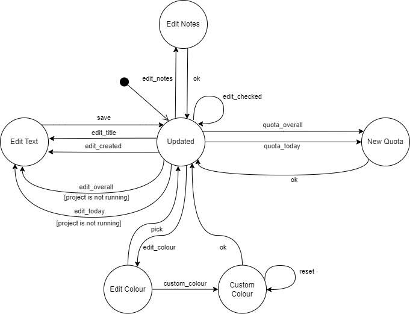

# Assignment 4 - Model-based Testing (Black-box Testing)

*Model-based Testing* is a black-box testing technique where the run time behaviour of the software under test is checked against predictions made by a model, which is a description of a system's behaviour. The model can then help systematically deriving tests for that system.

To try out this technique, we thought of three different use cases of the *jTimeSched* project.
For each one, we present the reason we decided to test it and its purpose.
Afterwards, we apply *Model-based Testing*, by presenting their:
- *State Machine*: to display all possible states of the system, as well as the available actions that result in a change of state.
- *Transition Tree*: to display all possible paths of execution in the system
- *Transition Table*: an alternative tabular way to display a State Machine, which allows better visualization of the sneaky paths.

After these steps, we can derive the tests based on the existing paths and their expected behaviour. Based on the transition tree of each use case, we derive the regular paths to be tested, where each test case corresponds to a path from the root of the tree to one of the leaves.
Besides this, we can also test the sneak paths, which are related to unspecified behaviour, as we need to evaluate how the system behaves in unexpected scenarios.

After these steps, **QF-Test** was used as a software tool to test the behaviour of each available path in the system.
This testing tool can simulate a specific chain of actions on the assignment's Graphical User Interface, as well as asserting conditions for expected outputs.

Even though the [documentation](https://paginas.fe.up.pt/~jcmc/tvvs/2022-2023/assignments/jtimesched-javadoc/index.html) of the project at hand is non-existent, limited only to the signature of the functions, we were fully capable of following a black-box approach.
To develop the tests, we only needed to know how the program works and its main functionalities, which we could derive after some time of experimenting, therefore we avoided being influenced when writing the tests.

To start the **QF-Test** tests from an initial state with some existing projects, it was necessary to select the working directory for the program to find the configuration file containing some projects.

For each use case, we tested every regular path and we additionally tested three sneak paths, all from the second use case.

## 1) Use Case 1: Add and Delete Projects

### Description

One of the main functionalities of the *jTimeSched* project is to add and delete projects. Therefore, it is important to create a model for testing this crucial functionality, since the malfunctioning of these functionalities could compromise the entire application.

### *Model-based Testing*

1. **State Machine**

The *State Machine* diagram has the following states:
- **Start**: the initial state of the application, before any user interaction, which contains a table with some predefined projects
- **Edit**: the currently selected project title is being edited, this state happens by default when the user creates a new project
- **Created**: the state after a new project has been added to the table
- **Deleted** - the state after a project has been deleted from the table

It also contains the following events:
- **add**: the *Add Project* button has been pressed, and the user is prompted to enter a name for the project
- **save**: the project's name is saved after its edition, finishing the process of its creation after pressing *Enter*
- **delete** - a project is deleted by double-clicking the *Delete Project* icon

The self-transition of **add** in the **Edit** state exists because the user can add a new project even before ending the title edition of the current project (without pressing *Enter*). When this happens, the previous project title is saved with the input right before this event, which, in the case of no edition from the user, is "New Project" by default, and we enter the **Edit** state of the new project. The other transitions are simple to understand and correspond to the expected program behaviour.

1. **Transition Tree**

The following figure contains a *Transition Tree* that represents all *six* regular paths for the use case. As all of them were tested, they are detailed in the following subsection.

1. **Transition Table**

Through the following *Transition Table*, it can be concluded that there are:
- 9 normal paths
- 3 sneak paths, even though in this case they are not worthy of testing as the **save** event can only happen on the **Edit** state.

### ***QF-Test*** tests

The *Setup* node of this use case is responsible for initializing the client and for launching the Java SUT console in case it is not running yet.
In addition, we also use a procedure from the **qfs** library to obtain the current date on which the tests are running, to compare later in the tests.
In the *Cleanup* node, we close the application window and disconnect the client, so that it can be started again in the following tests.

For this use case, the six regular paths deduced from the transition tree were tested, namely:
- Adding a project right after adding another but without saving the title edit
    - We start by creating a new project, then we check its default attributes ("New project" as title, the times zeroed, it must be unchecked, etc.), besides checking if the title field is focused and the date created is the one saved in the *Setup* node.
      Then, we change the title, check if the input text has actually changed, and only then we directly add a new project, without pressing *Enter* (saving it).
      Finally, we test the same attributes as before but for the recently added project. As we don't leave the *Exit* state, this test represents the self-transition *add* on the *State Machine* diagram.

- Deleting a project right after adding a new project without saving the title edit
    - This test case starts by fetching the text of a GUI component that contains the total number of projects and their overall and today times, which will be compared later.
      Afterwards, we add a new project and edit its title, verifying its attributes and the input content. Then, we delete this project and assert that the state has returned to the initial one, by comparing the above mentioned component and by checking the table content row by row.
      This way, we test the *delete* transition from the *Edit* to the *Deleted* state.

- Adding a project right after saving a previously added project
    - This test case starts by pressing the *Add Project* button to create the first project and check its default attributes while editing.
      Afterwards, the project's name is changed, the *Enter* key is pressed and it is asserted that the project name has been correctly changed.
      Finally, the *Add Project* button is clicked again and we check its default attributes.
      This way, we test the transition from the *Created* to the *Edit* state.

- Deleting a project after adding a new project and saving its title
    - This test case starts by fetching the GUI component with the table statistics. Then, we create a new project and assert that its attributes are correct, change the project's title and save it by pressing *Enter*, then check the content of the input.
      Afterwards, we delete this recently created project and then compare the statistics component and the table content row by row, asserting that the state has returned to the initial one.
      This way, we test the transition from the *Created* to the *Deleted* state.

- Adding a project after deleting another
    - We start by deleting a project from the table and then checking if the statistic component was correctly updated, as well as verifying the table content row by row.
      After this, we add a new project, and after checking its default attributes, we edit its title and change its colour.
      The test case ends by checking if these attributes were really changed.
      This way, we test the transition from the *Deleted* to the *Edit* state.

- Deleting a project after deleting a previous project
    - This test case starts by fetching the GUI component with the table statistics. Then, an assertion is made to verify the content of the table row by row.
      Afterwards, a specific project is deleted, which is then verified through a new table assertion.
      Finally, another project is deleted and a new table assertion is made to verify the number of existing projects, as well as each project's attributes.
      This way, we test the self-transition in the *Deleted* state.

All these tests pass, as expected.

## 2) Use Case 2: Edit Project attributes

### Description

In this project, it is essential to be able to edit the many fields of a project, namely its checked state, title, colour, date of creation, time overall and time today. Additionaly, we discovered other edition functionalities: the user can add notes to a projet and enter time quotas for both the overall and today times.
This editing possibilities ensure more flexibility to the user, who may fix some mistakes in the times of the projects, for example. As such, we decided to test this use case, to guarantee consistency upon these edition actions.
This section aims to test a model associated with all the possible editions.

### *Model-based Testing*

1. **State Machine**

The *State Machine* diagram has the following states:
- **Updated**: indicates that the table of projects is currently updated, with existing changes to a specific field of a project saved
- **Edit Text**: represents the state where a text field is being edited, such as the title of the project or the times
- **Edit Notes**: represents the state where the project's notes are being edited
- **New Quota**: represents the state where a *Time Quota* for a time field of the project, which works as an objective time to reach in the respective project, is being edited; this edition happens on a pop-up window
- **Edit Colour**: represents the state where the project's colour is being edited; consists of some predefined colour for quick selection and one option for accessing an advanced menu, moving to the following state
- **Custom Colour**: represents a specific state where an advanced menu for colour selection is being used, as a pop-up window; the available formats are Swatches (colour palette), HSV, HSL, RGB and CMYK

It also contains the following events:
- **edit_checked**: pressing the checkbox that marks a project as checked/unchecked (finished/unfinished)
- **edit_title**: double-clicking the title of the project to edit it
- **edit_created**: double-clicking the project's creation date to edit it
- **edit_overall**: double-clicking the project's overall time to edit it
- **edit_today**: double-clicking the project's today time to edit it
- **edit_notes**: right click the project's title cell to edit its notes
- **quota_overall**: right click the project's overall time to edit its quota
- **quota_today**: right click the project's today time to edit its quota
- **edit_colour**: click the project's colour to edit it
- **custom_colour**: press the *custom colour* icon in the *edit_colour* bar to select a custom colour
- **ok**: confirming the edition of the field mentioned in *edit_notes*, *quota_overall*, *quota_today* and *custom_colour*, closing the respective pop-up windows
- **reset**: reset button for the *custom_colour* advanced menu, discarding the user picks and restoring the default colour
- **pick**: select a quick colour in the *edit_colour* bar
- **save**: saving changes after editing the text fields, done by pressing the *Enter* key

The initial state is **Updated**, as the application starts with the predefined projects saved upon the last execution of the program. In the diagram we can see, for example, the possibility of choosing a quick colour (**pick**) or opening the custom colour menu.

1. **Transition Tree**

The following figure contains a *Transition Tree* which contains *seven* regular paths. As all of them were tested, they are detailed in the following subsection.

1. **Transition Table**

Through the following *Transition Table*, it can be concluded that there are:
- 16 normal paths
- 68 sneaky paths (we tested three of them which we consider relevant in our context)

### ***QF-Test*** tests

For this use case, we made two types of tests, namely:
- Seven tests to evaluate all the regular paths deducted from the transition tree
- Three tests to evaluate three selected sneak paths that we considered relevant

#### Regular Tests

- Setting *Time Overall* and *Time Today* quotas
    - This test case starts by checking the initial images of the *Time Overall* and *Time Today* fields (which contain a blue square if a quota currently exists).
      Then, a right mouse click is performed to the *Time Overall* field to open the dialog input, whose default attributes ("0:00:00" times, image...) are then verified.
      Afterwards, an input value is added to the dialog box, and this change is verified through an image comparison to the *Time Overall* tooltip.
      Finally, the same steps are applied to the *Time Today* field, whose behaviour is similar.
      This way, we test all transitions from the *Edit Quota* state. 

- Setting a project's notes
    - In this program, the notes of a project are displayed as a tooltip if we hover the mouse on top of the title field.
      We start this test by checking if the notes of a project are empty (no tooltip displayed). Then, by right-clicking the title field, we open the notes window.
      After waiting for this component to open, we assert that the window is visible and enabled and the input is empty and editable.
      Afterwards, we edit the notes and, after pressing *Ok*, we verify the tooltip of the title cell to check if the new notes are displayed.
      This way, we test all the transitions of the *Edit Notes* state.

- Editing the text fields of a project
    - This test aims to test the title, DateCreated, TimeOverall, TimeToday fields by evaluating its values before and after the introduced changes.
      Also, there is an additional assertion being made, given that when the *TimeToday* variable is changed, its value is added to the *Time Overall* field.
      This way, we test the transitions from the *Updated* state to the *Edit Text* state.

- Setting the colour of a project using Quick Colour selection
    - This test case starts by verifying the current colour of a project by checking its image.
    Then, the color dialog component is opened through a mouse click, assertions are made to verify that the dialog is opened, and a colour is selected.
      Finally, an image check is made to verify if the selected colour has been attributed to the project.
      This way, we test the transitions between the *Updated* state and the *Edit Colour* state. 

- Resetting the colour of the Custom Colour menu
    - The program has a complex colour selection menu, in which we can pick a colour using many formats.
    This menu contains a *Reset* button which discards the user picks, defining a previously defined colour, and this test case pretends to test that functionality.
    We start by clicking the colour field, which opens the quick selection pop-up. One of the options leads us to the custom colour menu. Both of these windows' visibility are tested, as well as some components presence, one of them being the default initial colour.
    Then, we choose one colour from the colour palette, verify if the preview component has changed, and finally we click on the *Reset* button, verifying afterwards if the preview returned to the default colour.
    This way, we test the self-transition *reset* in the *Custom Colour* state.

- Set Custom Colour
    - This test case starts by checking the current image of the project.
      Then, the basic colour selection menu is opened, whose image is also checked.
      Afterwards, the custom colour palette is prompted, and a specific custom colour is selected.
      Finally, an assertion is made to verify if the colour from the project has been adequately changed.
      This way, we tested the transition from the *Custom Colour* state to the *Update* state

- Set Project as Checked/Unchecked
    - This test case starts by verifying that the project is currently unchecked (The activity is not yet done).
      Then, the checkmark is clicked and an asseertion is made to verify that the project is now checked.
      Finally, the checkmarked is pressed again, and its veryfied if the checkbox ends the test case unchecked, just like its initial state.
      This way, we tested the *edit_checked* self transition from the *Updated* state.

#### Sneak Paths

- Can't edit times from a running projects
    - This test case starts by analyzing the project's current text fields.
      Then, the run project button is pressed and assertions are made to verify that the project has started running.
      Afterwards, its is verified  that the *Time Overall* and *Time Today* fields are uneditable, and that the remaining fields (*Date Created* and *Title*) are allowed to be edited and that their changes apply sucessfully.
      This way, we tested the sneak path between *Updated* to *Edit Text* with the *project is running* restriction, which is unsuccessful.

- Can't check/uncheck projects while editing a quota
    - This test case asserts that a user can't interact with the main window while another is opened, in this case, we verify that it can't check/uncheck projects while editing a quota.
    The test starts by confirming that the project is initially unchecked. Then, we right-click on the *Time Today* field to edit its quota, and this opens a new window for this edition.
    After verifying the visibility of this window, we tried to click on the check field of the main window, in the background.
    Upon noticing that the tool doesn't register this click, we had to record it with the quota window closed and then insert it a *Try* node, to handle the exception thrown, and this way the test passes.
    Finally, we end the test by checking if the project at hand is still unchecked.
    This way, we tested the sneak path that happens upon a *edit_checked* event in the *New Quota* state.

- Can't edit title while editing colour
    - This test case starts by checking the current text content of the *Title* field.
      Then, the colour panel is opened, followed by the custom colour panel.
      After checking that the custom colour panel is opened, an attempt to edit the project's *Title* field is made through a **Try** statement, which raises a *TestException* Exception.
      Finally, we verify that the current text in the *Title* field is still the same as the initial value, to ensure that no way unintended changes were made.
      This way, we tested the sneak path between the *Custom Colour* and *Edit Text* states, ensuring that the sneak transition does not occur. 

Both regular and sneak path tests pass.

## 3) Use Case 3: Start and Stop Projects

### Description

Finally, we must test the purpose of the entire application: the capability of counting the time spent in each of the projects.
The extreme importance of this functionality led us to choose to test this use case, despite its model being quite trivial.
For example, we must ensure that only a project that is not already running can be started.

### *Model-based Testing*

1. **State Machine**

The *State Machine* diagram has the following states:
- **Start**: the initial state of the application, in which all projects are paused
- **Running**: indicates that a project is running
- **Paused**: indicates that a running project has been paused

It also contains the following events:
- **start**: a project's start/stop icon has been pressed on a paused project
- **stop**: a project's start/stop icon has been pressed on a running project

The diagram is simple but represents this entire functionality.

1. **Transition Tree**

The following figure contains a *Transition Tree* which contains only a single regular path, detailed in the following subsection.

1. **Transition Table**

Through the following table, it can be concluded that there are:
- 3 normal paths
- 3 sneak paths

### ***QF-Test*** tests

For this use case, only a single path was deduced from the transition tree, which we tested by:

- Start and Pause a project
    - This test case starts by checking the initial state by asserting that both *Overall* and *Today* times are zeroed and the project is paused.
    Then, we start it and check if it's running, besides ensuring that both times are now non-editable.
    Finally, we stop the project after three seconds, which we configured by inserting a delay of 3000 ms before the click on the pause button.
    Right after pausing it, we check if both times are now set as "0:00:03" and assert that the project is paused.
    This way, we test all the transitions in the *State Machine* diagram.

The test passes, as expected.

## ***QF-Test*** tool feedback

Our experience with the **QF-Tool** was generally positive.
We will now highlight some features that we think would be excellent additions to the tool, as they would make the user's life easier in some cases that we came across throughout this work:
    - When using the tool to test a Web page, in the "Open Browser Window" action there should be an option to open the window in Full-screen or fully expanded, since by default it does not fill the entire screen, which can lead to disappearance of some buttons in the interface due to the responsiveness of the site to be tested.
    To solve this problem, it was necessary to find out the "width" and "height" of the screen and change these fields, but it would be useful for the program to do this automatically when we select a checkbox to open the already expanded window
    - When selecting a table, there should be a button to count its number of rows, without having to specify its content
    - It should be possible to test that bar on top of application windows, with the name and icon of the window
    - When recording double clicks, the click coordinates should be saved, as it may have a different effect depending on the location of the click. For example, if we edit text input, the click location would indicate the cursor positioning in that input.

-----

## Group 10

- Hugo Guimarães, up201806490
- Paulo Ribeiro, up201806505

## Sources

- [Class Slides - Prof. José Campos](https://paginas.fe.up.pt/~jcmc/tvvs/2022-2023/lectures/lecture-4.pdf)
- [Model-based Testing - Guru99](https://www.guru99.com/model-based-testing-tutorial.html)
- [Online Search - QF-Test](https://www.qfs.de/en/search-results.html)