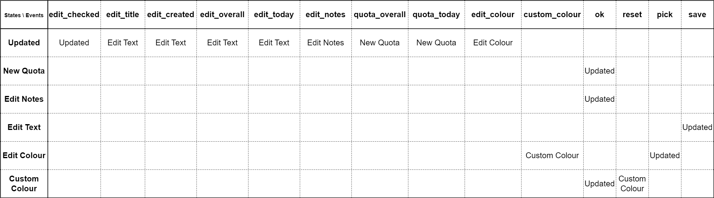

# Assignment 4 - Model-based Testing (Black-box Testing)

// TODO: introdução -> explicar Model-based Testing e conceitos relacionados (state machine, transition tree, etc) + dizer coisas gerais do report (explicar QF-Test, etc)

// TODO: falar da config do QF_Test, metemos working directory para ele ir buscar os projetos já existentes

### 1) Use Case 1: Add and Delete Projects

#### Description

// TODO: explicar use case e dizer o pq de o escolhermos

#### *Model-based Testing*

1. **State Machine**

// TODO: Meter diagrama e explicá-lo

2. **Transition Tree**

// TODO: Meter diagrama e explicá-lo

3. **Transition Table**

// TODO: Meter tabela e explicá-la

#### ***QF-Test*** tests

// TODO: enumerar os testes derivados e falar da sua implementação no QF-Test, e também falar do outcome e explicá-lo

// TODO: falar do sneak path deste use case e da sua implementação

Neste caso ->>>> sneak path pode ser dar add project em edit mode, que funciona

### 2) Use Case 2: Edit project attributes

#### Description

// TODO: explicar use case e dizer o pq de o escolhermos

#### *Model-based Testing*

1. **State Machine**

// TODO: Meter diagrama e explicá-lo

2. **Transition Tree**

// TODO: Meter diagrama e explicá-lo

3. **Transition Table**

// TODO: Meter tabela e explicá-la

#### ***QF-Test*** tests

// TODO: enumerar os testes derivados e falar da sua implementação no QF-Test, e também falar do outcome e explicá-lo

// TODO: falar do sneak path deste use case e da sua implementação

### 3) Use Case 3: Start and stop a project

#### Description

// TODO: explicar use case e dizer o pq de o escolhermos

#### *Model-based Testing*

1. **State Machine**

// TODO: Meter diagrama e explicá-lo

2. **Transition Tree**

// TODO: Meter diagrama e explicá-lo

3. **Transition Table**

// TODO: Meter tabela e explicá-la

#### ***QF-Test*** tests

// TODO: enumerar os testes derivados e falar da sua implementação no QF-Test, e também falar do outcome e explicá-lo

// TODO: falar do sneak path deste use case e da sua implementação

## ***QF-Test*** tool feedback

// TODO: meter feedback do QF-Test (opinião, coisas a melhorar)

-----

#### Group 10

- Hugo Guimarães, up201806490
- Paulo Ribeiro, up201806505

#### Sources

- [Class Slides - Prof. José Campos](https://paginas.fe.up.pt/~jcmc/tvvs/2022-2023/lectures/lecture-4.pdf)
- [Online Search - QF-Test](https://www.qfs.de/en/search-results.html)