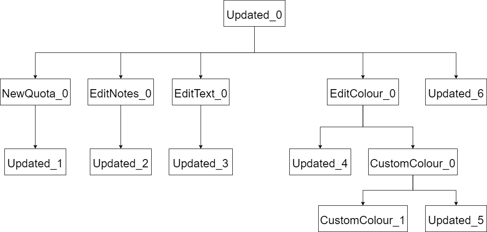

# Assignment 4 - Model-based Testing (Black-box Testing)

// TODO: introdução -> explicar Model-based Testing e conceitos relacionados (state machine, transition tree, etc) + dizer coisas gerais do report (explicar QF-Test, etc)

Model Base Testing is a black-box testing technique in which a model of a software system is used to help systematically deriving tests for that system

(Falar de models em si?)
Models are simplifications of the real system that allow testing specific properties, making it easier to fragment the tests and evaluate small individual instances of the project.

The behaviour of each model was analyzed using:
- State Machines - To display all possible states of each model, as well as the available actions that result into a change of state. 
- Transition Trees - To display all possible paths of exucution in the system
- Transition Tables - As an alternative tabular way to display a State Machine.

// TODO: Falar de que as transition tables são boas para distinguir regular paths de sneaky paths, e explicar qual é qual.

Afterwards, QF-Test was used as a software tool to test the behaviour of each available path in each chosen model.
This testing tool is able to simulate a specific chain of actions on the assignment's Graphical User Interface, as well as asserting conditions for expected outputs.

To try out these techniques, three use cases from the *jTimeSched* project were selected and tested following a black-box approach.

// TODO: falar da config do QF-Test, metemos working directory para ele ir buscar os projetos já existentes

In order to start the QF-Test tool with existing projects, it was necessary to select the working directory to include the projects created in the previous assignments, which function as a common initial state for all Use Cases

### 1) Use Case 1: Add and Delete Projects

#### Description

One of the main functionalities of the *jTimeSched* project is to add and delete projects. Therefore, it is important to create a model for testing this crucial functionality.

#### *Model-based Testing*

1. **State Machine**

The State Machine Diagram has the following states:
- Start - The initial state which contains a table with several projects;
- Edit - This state means that the currently selected project is being edited on any of its fields;
- Created - This state means that a new project has been added to the table;
- Deleted - This state means that a proejct has been deleted from the table.

It also contains the following events:
- add - The *Add Project* button has been pressed, and the user is prompted to enter a name for the project;
- save - The project's name has been saved after its edition, finishing the process of creating a project;
- delete - A project has been sucessfully deleted by double-clicking the *delete project* button. 

1. **Transition Tree**

The following figure contains a *Transition Tree* that represents all the *six* posible paths for the Use Case.

1. **Transition Table**

Through the following Transition Table, it can be concluded that there are:
- 9 normal paths;
- 3 sneaky paths;

#### ***QF-Test*** tests

// TODO: enumerar os testes derivados e falar da sua implementação no QF-Test, e também falar do outcome e explicá-lo

// TODO: falar do sneak path deste use case e da sua implementação

Neste caso ->>>> sneak path pode ser dar add project em edit mode, que funciona

### 2) Use Case 2: Edit Project attributes

#### Description

In this project, it is essential to be able to edit the many fields of a project. This section aims to test a model associated with all the possible editing actions.

#### *Model-based Testing*

1. **State Machine**

The State Machine Diagram has the following states:
- Updated - Initial State. This state indicates that changes have sucessfulyy been made to a specific field of a project;
- Edit Text - Represents the state where a text field is being edited, such as the name of the project;
- Edit Notes - Representes the state where the project's notes are being edited;
- New Quota - Represents the state where a *Time Quota* for a time field of the project is being edited. The *Time Quota* works as an objective time to reach in the project;
- Edit Colour - Represents that state where the project's colour is being edited;
- Custom Colour - Represents a specific state where an advance menu of color selection is being used for color editing. The available parameters  are Swatches (colour pallete), HSV, HSL, RGB, CMYK selection.

It also contains the following events:
- edit_checked - Pressing the checkmark that represents a project being running;
- edit_title - Double clicking the name of the project to edit it; 
- edit_created - Double clicking project's creation date to edit it;
- edit_overall - Double clicking project's overall time to edit it;
- edit_today - Double clicking project's today's time to edit it;
- edit_notes - Right click project's tite cell to edit its notes;
- quota_overall - Right click project's overall time to edit its quota;
- quota_today - Right click project's today time to edit its quota;
- edit_colour - Right click project's colour to edit it;
- custom_colour - Press *custom colour* menu in the *edit_colour* menu to select a custom colour;
- ok - Confirming the edition of the field mentioned in *edit_notes*, *quota_overall*, *quota_today* and *custom_colour*;
- reset - Reset button for the *custom_colour* advanced menu;
- pick - Select the color in the *edit_colour* menu;
- save - Saving while editing the text fields. can be done by pressing the *Enter key*.

1. **Transition Tree**

The following figure contains a *Transition Tree* which contains *six*  paths.

1. **Transition Table**

Through the following Transition Table, it can be concluded that there are:
- 16 normal paths;
- 68 sneaky paths; (check afterwards how many are relevant)

#### ***QF-Test*** tests

// TODO: enumerar os testes derivados e falar da sua implementação no QF-Test, e também falar do outcome e explicá-lo

// TODO: falar do sneak path deste use case e da sua implementação

### 3) Use Case 3: Start and Stop Projects

#### Description

// TODO: explicar use case e dizer o pq de o escolhermos

#### *Model-based Testing*

1. **State Machine**

The State Machine Diagram has the following states:
- Start - The initial state which contains a table with several paused projects;
- Running - This state indicates that a project is running;
- Paused -  This state indicates that a running project has been paused.

It also contains the following events:
- start - A project's checkbox has been pressed, which makes it start running.
- stop - A project's checkbox has been pressed, which makes it stop running.
 

1. **Transition Tree**

1. **Transition Table**

Through the following table, it can be concluded that there are:
- 3 normal paths;
- 3 sneaky paths;

#### ***QF-Test*** tests

// TODO: enumerar os testes derivados e falar da sua implementação no QF-Test, e também falar do outcome e explicá-lo

// TODO: falar do sneak path deste use case e da sua implementação

// TODO: falar que verificamos se as cells não são editáveis

// TODO: falar do "delay before" do clique do pause

## ***QF-Test*** tool feedback

// TODO: meter feedback do QF-Test (opinião, coisas a melhorar)

-----

#### Group 10

- Hugo Guimarães, up201806490
- Paulo Ribeiro, up201806505

#### Sources

- [Class Slides - Prof. José Campos](https://paginas.fe.up.pt/~jcmc/tvvs/2022-2023/lectures/lecture-4.pdf)
- [Online Search - QF-Test](https://www.qfs.de/en/search-results.html)