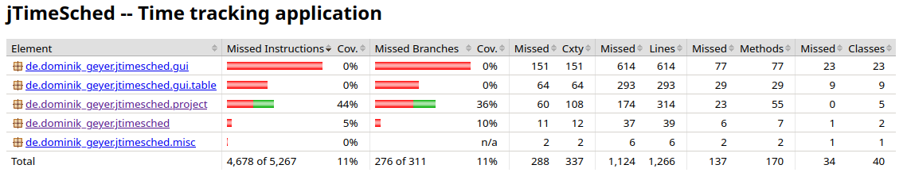
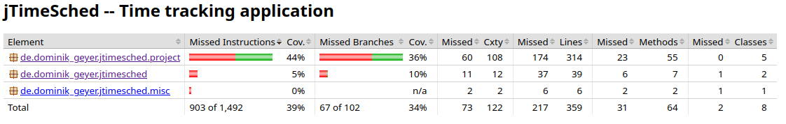

# Assignment 5 - Structural Testing: Line and Decision coverage (White-box Testing)

*Structural Testing* is a white-box testing technique used to test the internal design of the software or the structure of the coding for the particular software.
*Code coverage* is a metric that can help you understand how much of your source code is tested.
Measurement of *structural coverage* of code is an objective means of assessing the thoroughness of testing.
There are various industry-standard metrics available for measuring structural coverage, but in this report, we will explore only two of them:
- *Line Coverage*: how many lines of source code have been tested
- *Branch Coverage*: how many of the branches of the control structures (if statements, for instance) have been executed

To analyze the depth of our unit tests, we used the **JaCoCo** tool; a code coverage reports generator for **Java** projects.
The first step we took was to assess the coverage resulting from tests developed for previous assignments.
To configure this tool in our project, we had to modify the `pom.xml` file by adding the *JaCoCo* and *Surefire* plugins.

After a first analysis of the coverage of our tests, we developed more unit tests to get closer to 100% coverage (excluding GUI features).
So, we focused on the `project` and `misc` sub-packages, in addition to testing the main class, located in the `jtimesched` package.

We developed each test with the desired coverage in mind, and we tried to make the most of **JUnit**'s features, which will be described in the second section.
As for the naming of test methods, we follow a *MethodName_StateUnderTest_ExpectedBehaviour* approach.

Finally, after reaching the desired depth, a final report on the project's coverage will be generated and discussed in the last section.

## 1) Initial Line and Branch Coverage

Aqui se calhar deviamos correr os testes de novo no commit inicial, por causa dos teste da GUI que excluímos

// TODO: prints da coverage antes de fazer testes, e descrever um pouco o coverage report ()

Since we performed black-box testing in previous assignments, the initial code coverage is not zero.
Therefore, we ran the tests and generated a **JaCoCo** report, displaying the following coverage:



The report analyzes *line coverage* and *branch coverage*, displaying the number of lines, branches, classes and methods missed, as well as the percentage of coverage.
This analysis is done in each file and folder, allowing navigation between different folders by clicking them.
Also, if a file is selected instead, it is possible to visualize all the covered lines and branches, which results in a necessary functionality to help increase the coverage iteratively.
The previous image shows the project's total coverage in the *Total* column, as it is located in the root directory.

After a better analysis, it was concluded that the *de.dominik_geyer.jtimesched.gui* and *de.dominik_geyer.jtimesched.gui.table* directories were not worth testing, since they were associated with the GUI.
Therefore, the `pom.xml` was changed to ignore those elements, resulting in the following report:



Therefore, the assignment's initial coverage contains:
- ??% Line Coverage
- ??% Branch Coverage

## 2) JUnit features

// TODO: introdução a dizer quais as classes que decidimos testar e porquê

As stated before, we decided to just test the non-GUI related classes, that is, the ones in the packages:

- `misc`: functions that are required from lots of places in the code, in this case, related to date formatting
- `project`: main code with the program logic

Besides this, we also tested the main class, located in the `src` package.

In this section, we describe the most interesting features of **JUnit** applied in our tests.

// TODO: no formatDate remover testes inúteis -> após perguntar ao stor o que está pinned

### Assertions

One of the leading testing goals is to compare the *expected value* to the *actual value* of a code execution.
To perform this comparison, the *JUnit* *Assertions* library provides the following methods:
- `static void assertTrue(boolean condition)` - Asserts that the provided *condition* is true
- `static void assertFalse(boolean condition)` - Asserts that the provided *condition* is false
- `static void assertEquals(Object Expected, Object Actual)` - Asserts that *expected* and *actual* are equal. Both arguments must be of the same type
- `static <T extends Throwable> assertThrows(assertThrows(Class<T> expectedType, Executable executable)` - Asserts that the execution of the supplied executable throws an exception of te expectedType and returns the exception
- `static void assertAll(Executable... executables)` - Asserts that all supplied executables do not throw exceptions

#### 1) **assertTrue** && **assertFalse**
We used these methods when the evaluated result's variable type was **boolean**

TThe following code segment shows a test containing an assertTrue to ensure a project runs after it has started.
It also contains two `assertFalse` statements to ensure that the project is not running when initialized or after issuing a command to pause it.

```java
@Test
public void testSetRunning_BooleanInput_ShouldChangeState() {
    Project proj = new Project();
    Assertions.assertFalse(proj.isRunning());
    proj.setRunning(true);
    Assertions.assertTrue(proj.isRunning());
    proj.setRunning(false);
    Assertions.assertFalse(proj.isRunning());
}
```

#### 2) **assertEquals**
We used this method when the value of two variables of non-boolean type were being compared. We could also use the `assertSame()` method to compare *primitives*, given that it uses the '==' operator instead of the *equals* method. For simplicity and to avoid unnecessary mistakes, we only used assertEquals.

For instance, the following code segment displays a test which evaluates the number of existing projects in the table, which is expected to be three (which were added in the @BeforeEach section)

```java
@Test
public void testGetRowCount_InpuNumberOfCreatedTestProjects_ShouldBeThree(){
    assertEquals(3,tableModel.getRowCount());
}
```

https://stackoverflow.com/questions/1201927/is-javas-assertequals-method-reliable

#### 3) **assertThrows**
This method allowed testing code segments where a specific exception should be thrown, testing the code's behaviour in error scenarios.

For example, the following test uses the `assertThrows` method to ensure that a project that is not running raises a *ProjectException* when the `elapsedSeconds` method is called
```java
@Test
public void testGetElapsedSeconds_IdleProject_ShouldThrowException() {
    // Project should not be running before it is started
    Assertions.assertFalse(proj.isRunning());
    assertThrows(ProjectException.class, proj::getElapsedSeconds);
}
```

#### 4) **assertAll**
This method allows running the *assertions* above inside a single statement.
It always checks all of the assertions in the argument list, no matter how many fail.
This means that if at least one fails, a detailed result of all tests is prompted.
It is best used for asserting a test set of properties that belong together, such as the fields of a non-primitive object with no predefined *equals* and *hashCodes* methods.

For example, the following code segment shows a use case of the `assertAll` method, where all the fields of two *Project* variables are being compared.

```java
assertAll("Compare both Projects",
    () -> assertEquals(prj.getTitle(), returned.getTitle()),
    () -> assertEquals(prj.getNotes(), returned.getNotes()),
    () -> assertEquals(prj.getTimeCreated(), returned.getTimeCreated()),
    () -> assertEquals(prj.getSecondsToday(), returned.getSecondsToday()),
    () -> assertEquals(prj.getSecondsOverall(), returned.getSecondsOverall()),
    () -> assertEquals(prj.getQuotaOverall(), returned.getQuotaOverall()),
    () -> assertEquals(prj.getQuotaToday(), returned.getQuotaToday()),
    () -> assertEquals(prj.getTimeStart(), returned.getTimeStart()),
    () -> assertEquals(prj.getColor(), returned.getColor()));
```

https://stackoverflow.com/questions/40796756/assertall-vs-multiple-assertions-in-junit5

### Feature Y

// TODO: descrever feature Y

#### @Test
This tag was used to indicate that the ensuing code segment must be interpreted as a *Java* test.

#### @BeforeEach
This tag was used to always run a code segment before every test within the same scope.

#### @Nested
This tag was used to form logical groups of test cases while also improving the organization of big test classes.

#### @ParameterizedTest
This feature enables executing a single test method multiple times with different parameters.
It replaces `@Test` and can be combined with the following tags:
- `@ValueSource` - Enables the specification of a single array of literal values and can only be used for providing a single argument per parametrized test invocation
- `@CsvSource` - Expresses arguments lists as comma-separated values
- `@MethodSource`- Used to match an existing method, such as a `static Stream<Arguments>`, to allow passing complex objects as arguments.

This tag also contains an argument `name`, which allows having a name displayed on the *Debug Console* after execution.
Also, the number of the parametrized test can be passed, as well as its arguments, providing a distinction between each test instance to improve readability, which is shown in the following code segment:


```java
@ParameterizedTest(name = "Test #{index} with Positive input {arguments}")
@ValueSource(ints = {1,10,60,120})
public void testSetSecondsOverall_PositiveInput_ShouldUpdateSeconds(int seconds) {
    assertEquals(0, proj.getSecondsOverall());
    proj.setSecondsOverall(seconds);
    assertEquals(seconds, proj.getSecondsOverall());
}

```
After Running:


#### @DisplayName
Provides a name to the test, improving readability while debugging.

https://stackoverflow.com/questions/36220889/whats-the-purpose-of-the-junit-5-nested-annotation


## 3) Final Line and Branch Coverage

After performing extensive testing, we ended up with the following code coverage:


// TODO: prints da coverage depois de fazer testes, e descrever um pouco o coverage report

-----

## Group 10

- Hugo Guimarães, up201806490
- Paulo Ribeiro, up201806505

## Sources

- [Class Slides - Prof. José Campos](https://paginas.fe.up.pt/~jcmc/tvvs/2022-2023/lectures/lecture-5.pdf)
- [Structural (Code) Coverage - QA Systems](https://www.qa-systems.com/blog/what-is-meant-by-structural-code-coverage/)
- [Coverage Counters - JaCoCo](https://www.eclemma.org/jacoco/trunk/doc/counters.html)
- [Parametrized Tests - Baeldung](https://www.baeldung.com/parameterized-tests-junit-5)
- [Junit User Guide - JUnit](https://junit.org/junit5/docs/current/user-guide)
