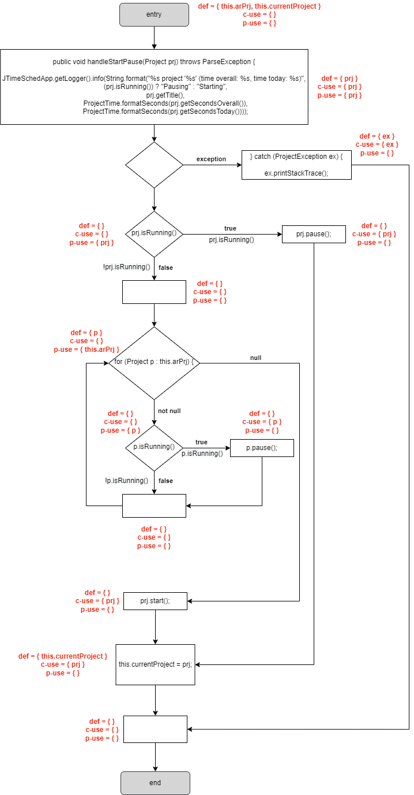

# Assignment 8 - Dataflow Testing (White-box Testing)

- Dataflow Coverage -> Considers how data gets accessed and modified in the system and how it could get corrupted.

// TODO -> descrever dataflow testing, c-use, p-use, all-defs, all-c-uses, all-p-uses, all-uses

## 1) `public static int parseSeconds(String strTime) throws ParseException`

### Description

// TODO: descrever a função e dizer porquê que a escolhemos

#### *Dataflow Testing*

```java
1.  public static int parseSeconds(String strTime) throws ParseException {
2.      Pattern p = Pattern.compile("(\\d+):([0-5]?\\d):([0-5]?\\d)");    // 0:00:00
3.      Matcher m = p.matcher(strTime);
4. 
5.      if (!m.matches()) {
6.          throw new ParseException("Invalid seconds-string", 0);
7.      }
8. 
9.      int hours = Integer.parseInt(m.group(1));
10.     int minutes = Integer.parseInt(m.group(2));
11.     int seconds = Integer.parseInt(m.group(3));
12. 
13.     return (hours * 3600 + minutes * 60 + seconds);
14. }
```

// TODO: frase introdutória de CFG


// TODO: frase introdutória de def-use graph


// TODO: dizer variáveis relevantes e meter tabela com def-use pairs para cada variável

// TODO: all-defs, all-c-uses, all-p-uses, all-uses

#### Unit Tests

// TODO: falar sobre os unit tests implementados e descrever outcome

## 2) `public void adjustSecondsToday(int secondsToday)`

### Description

// TODO: descrever a função e dizer porquê que a escolhemos

#### *Dataflow Testing*

```java
1.  public void adjustSecondsToday(int secondsToday) {
2.      if (secondsToday < 0) {
3.          secondsToday = 0;
4.      }
5.  
6.      int secondsDelta = secondsToday - this.secondsToday;
7.  
8.      this.setSecondsOverall(this.getSecondsOverall() + secondsDelta);
9.      this.setSecondsToday(secondsToday);
10. }
```

// TODO: frase introdutória de CFG


// TODO: frase introdutória de def-use graph


// TODO: dizer variáveis relevantes e meter tabela com def-use pairs para cada variável

// TODO: all-defs, all-c-uses, all-p-uses, all-uses

#### Unit Tests

// TODO: falar sobre os unit tests implementados e descrever outcome

## 3) `public void handleStartPause(Project prj) throws ParseException`

### Description

// TODO: descrever a função e dizer porquê que a escolhemos

#### *Dataflow Testing*

```java
1.  public void handleStartPause(Project prj) throws ParseException {
2.      JTimeSchedApp.getLogger().info(String.format("%s project '%s' (time overall: %s, time today: %s)",
            (prj.isRunning()) ? "Pausing" : "Starting",
            prj.getTitle(),
            ProjectTime.formatSeconds(prj.getSecondsOverall()),
            ProjectTime.formatSeconds(prj.getSecondsToday())));
3. 
4.      try {
5.          if (prj.isRunning()) {
6.              prj.pause();
7.          } else {
8.              // pause all other projects
9.              for (Project p : this.arPrj) {
10.                 if (p.isRunning()) {
11.                     p.pause();
12.                 }
13.             }
14.
15.             // set project to run-state
16.             prj.start();
17.         }
18.
19.         this.currentProject = prj;
20.         this.updateTrayCurrentProject();
21.
22.     } catch (ProjectException ex) {
23.         ex.printStackTrace();
24.     }
25.
26.     // update table
27.     this.updateGUI();
28. }
```

// TODO: frase introdutória de CFG


// TODO: frase introdutória de def-use graph



// TODO: dizer variáveis relevantes e meter tabela com def-use pairs para cada variável

// TODO: all-defs, all-c-uses, all-p-uses, all-uses

#### Unit Tests

// TODO: falar sobre os unit tests implementados e descrever outcome

-----

## Group 10

- Hugo Guimarães, up201806490
- Paulo Ribeiro, up201806505

## Sources

- [Class Slides - Prof. José Campos](https://paginas.fe.up.pt/~jcmc/tvvs/2022-2023/lectures/lecture-7.pdf)