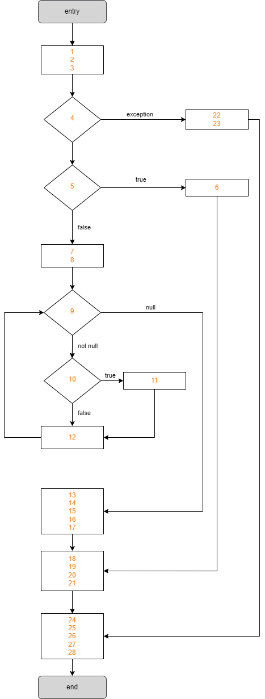

# Assignment 8 - Dataflow Testing (White-box Testing)

*Dataflow testing* is used to analyze the flow of data in the program.
It is the process of collecting information about how the variables flow the data in the program, focusing on each particular point in the process.
It consists of a group of testing strategies to examine the control flow of programs in order to explore the sequence of variables according to the series of events.
It mainly focuses on the points at which values are assigned to the variables and the points at which these values are used.
By concentrating on both points, data flow can be tested.
*Dataflow testing* uses the control flow graph to detect illogical things that can interrupt the flow of data.

There are five concepts to highlight in this type of testing:
- **def**: definition of a variable - it's the occurrence of a variable when a value is bound to it
- **c-use**: computation use - when the value of a variable is used to compute a value for output or for defining another variable
- **p-use**: predicate use - when the value of a variable is used to decide an execution path
- **def-clear path**: definition clear path - path with respect to a variable `v` if it has no variable re-definition of `v` on the path
- **def-use pair**: definition-use pair - pair (`d`,`u`) with respect to a variable `v` where `d` is a node defining `v`, `u` is a node or edge using `v`, and there is a **def-clear path** with respect to `v` from `d` to `u`

In this type of testing, there are different types of coverage criteria. In this report, we will focus on the following:
- **all-defs**: achieved as there is at least one **def-clear path** from every definition of each variable to at least one **c-use** or **p-use** of each variable
- **all-c-uses**: achieved when, for every program variable, at least one **def-clear path** from every definition of that variable to every **c-use** of it must be covered
- **all-p-uses**: achieved when, for every program variable, at least one **def-clear path** from every definition of that variable to every **p-use** of it must be covered
- **all-uses**: achieved when, for every program variable, at least one **def-clear path** from every definition of that variable to every **c-use** and every **p-use** (including all outgoing edges of the predicate statement) of it must be covered - requires that all **def-use pairs** are covered

To try out this technique, we selected three different functions of the *jTimeSched* project.
For each one, we present the reason we decided to test it and its purpose.
Then, we show the **CFG** (control-flow graph) of the function, from which we also build the **def-use graph** (dataflow graph), which captures the flow of definitions (also known as defs) across basic blocks in a program.
After that, we apply *Dataflow Testing* to each variable of that function, displaying a tabular summary with the **def-use pairs** for each.
The last step is to define all paths for each coverage criteria: **all-defs**, **all-c-uses**, **all-p-uses**, and **all-uses**.
Finally, we describe the unit tests we created based on this method and their outcomes.

As for the naming of test methods, we follow a *MethodName_StateUnderTest_ExpectedBehaviour* approach.

## 1) `public static int parseSeconds(String strTime) throws ParseException`

### Description

// TODO: descrever a função e dizer porquê que a escolhemos

#### *Dataflow Testing*

```java
1.  public static int parseSeconds(String strTime) throws ParseException {
2.      Pattern p = Pattern.compile("(\\d+):([0-5]?\\d):([0-5]?\\d)");    // 0:00:00
3.      Matcher m = p.matcher(strTime);
4. 
5.      if (!m.matches()) {
6.          throw new ParseException("Invalid seconds-string", 0);
7.      }
8. 
9.      int hours = Integer.parseInt(m.group(1));
10.     int minutes = Integer.parseInt(m.group(2));
11.     int seconds = Integer.parseInt(m.group(3));
12. 
13.     return (hours * 3600 + minutes * 60 + seconds);
14. }
```

// TODO: frase introdutória de CFG


// TODO: frase introdutória de def-use graph


// TODO: dizer variáveis relevantes e meter tabela com def-use pairs para cada variável

// TODO: all-defs, all-c-uses, all-p-uses, all-uses

#### Unit Tests

// TODO: falar sobre os unit tests implementados e descrever outcome

## 2) `public void adjustSecondsToday(int secondsToday)`

### Description

// TODO: descrever a função e dizer porquê que a escolhemos

#### *Dataflow Testing*

```java
1.  public void adjustSecondsToday(int secondsToday) {
2.      if (secondsToday < 0) {
3.          secondsToday = 0;
4.      }
5.  
6.      int secondsDelta = secondsToday - this.secondsToday;
7.  
8.      this.setSecondsOverall(this.getSecondsOverall() + secondsDelta);
9.      this.setSecondsToday(secondsToday);
10. }
```

// TODO: frase introdutória de CFG


// TODO: frase introdutória de def-use graph


// TODO: dizer variáveis relevantes e meter tabela com def-use pairs para cada variável

// TODO: all-defs, all-c-uses, all-p-uses, all-uses

#### Unit Tests

// TODO: falar sobre os unit tests implementados e descrever outcome

## 3) `public void handleStartPause(Project prj) throws ParseException`

### Description

// TODO: descrever a função e dizer porquê que a escolhemos

#### *Dataflow Testing*

```java
1.  public void handleStartPause(Project prj) throws ParseException {
2.      JTimeSchedApp.getLogger().info(String.format("%s project '%s' (time overall: %s, time today: %s)",
            (prj.isRunning()) ? "Pausing" : "Starting",
            prj.getTitle(),
            ProjectTime.formatSeconds(prj.getSecondsOverall()),
            ProjectTime.formatSeconds(prj.getSecondsToday())));
3. 
4.      try {
5.          if (prj.isRunning()) {
6.              prj.pause();
7.          } else {
8.              // pause all other projects
9.              for (Project p : this.arPrj) {
10.                 if (p.isRunning()) {
11.                     p.pause();
12.                 }
13.             }
14.
15.             // set project to run-state
16.             prj.start();
17.         }
18.
19.         this.currentProject = prj;
20.         this.updateTrayCurrentProject();
21.
22.     } catch (ProjectException ex) {
23.         ex.printStackTrace();
24.     }
25.
26.     // update table
27.     this.updateGUI();
28. }
```

// TODO: frase introdutória de CFG



// TODO: frase introdutória de def-use graph


// TODO: dizer variáveis relevantes e meter tabela com def-use pairs para cada variável

// TODO: all-defs, all-c-uses, all-p-uses, all-uses

#### Unit Tests

// TODO: falar sobre os unit tests implementados e descrever outcome

-----

## Group 10

- Hugo Guimarães, up201806490
- Paulo Ribeiro, up201806505

## Sources

- [Class Slides - Prof. José Campos](https://paginas.fe.up.pt/~jcmc/tvvs/2022-2023/lectures/lecture-7.pdf)
- [Dataflow Testing - Javatpoint](https://www.javatpoint.com/data-flow-testing-in-white-box-testing)