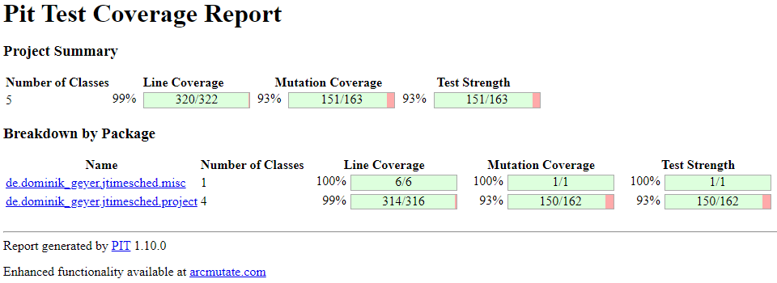

# Assignment 9 - Mutation Testing (White-box Testing)

*Mutation Testing* is a type of software testing in which certain statements of the source code are changed/mutated to check if the test cases are able to find source code errors.
Its goal is to ensure the quality of test cases in terms of robustness so that they should fail the mutated source code.
The changes made in the mutant program should be kept extremely small so that it does not affect the program's overall objective.
A **mutation** is nothing but a single syntactic change that is made to the program statement.
If the tests fail, the **mutation** is killed; if your tests pass, the **mutation** survives.
The quality of the tests can be gauged from the percentage of **mutations** killed.

Mutants that cannot be killed are called **equivalent mutants**.
An **equivalent mutant** is a mutant that always behaves the same way as the original program.
If the mutant behaves like the normal code, it will always give the same output as the original program for any given input.
Clearly, this makes this mutant (which is basically the same program as the one under test) impossible to be killed by the tests.

To assess the robustness of our tests, we used the **Pitest** tool, a mutation testing system.
The first step we took was to configure **Pitest** in our project.
For this, we had to update the *JUnit jupiter* plugins version to 5.9.1 and the *maven-surefire-plugin* version to 3.0.0-M7, in addition to removing the *junit-platform-surefire-provider* plugin.
Then, we needed to add the **Pitest** plugin, including a dependency that would support **JUnit 5**.
Lastly, we had to exclude some test classes, namely the main and GUI classes, since it was not our goal to test them.

Upon setting up this tool, we executed an initial **mutation analysis** by running the command `mvn test-compile org.pitest:pitest-maven:mutationCoverage`.
After analyzing the results, we first identified the **equivalent mutants** and only then created more unit tests to kill the remaining mutants.
Both of these steps are described in the following sections.
Finally, this report ends with the execution of the final **mutation analysis** after we have developed these tests.

## 1) Initial Mutation Score

The first step consisted of performing an initial analysis of the mutation coverage derived from the tests developed in previous assignments.
This first score surprised us positively due to its relatively high values, as shown in the following image:


However, these values are justified because we have extensively tested the program throughout the project, using either black-box or white-box testing techniques.
Looking at the previous figure, we can see that several mutants were already killed by the tests performed in previous assignments.
The mutants that still need to be addressed are inside the `project` package, whose class breakdown can be better visualized in the following figure:


As we can see, the mutants that survived can be found in the classes `Project.java`, `ProjectSerializer.java` and `ProjectTableModel.java`.
This assignment aims to increase the mutation score of our tests, seeking to eliminate as many mutations as possible.

## 2) Equivalent Mutants

### In file `Project.java`

#### Lines 163 & 177

The first mutants we found consisted of removing calls to the `printStackTrace` method from exceptions thrown in the code.
These exceptions would only happen if there was an attempt to get the elapsed seconds of a project that is not running.
The mutants survived, as removing the calls had no effect on the program's behavior.
The main cause of this is essentially due to the fact that this scenario never happens, as it is prevented by an `if` statement performed before calling the method that could throw them.
This verification ensures that no exception is thrown, so the statement at hand is never executed.


### In file `ProjectSerializer.java`

#### Line 63

This next mutant also consists of removing a method call, namely a method responsible for defining the number of spaces used in the indentation of the XML file to be written.
The fact that the mutant survives, despite correctly testing by reading the resulting XML, suggests that this call is not fundamental to the program at all.
We also noticed that the code contained an author comment with a link to a given bug in a bug database ([Bug Link/ID](http://bugs.sun.com/bugdatabase/view_bug.do?bug_id=6296446)).
After studying the subject, we concluded that, despite the default indentation value being already 4, the author was forced to make this function call due to the aforementioned bug, which is currently fixed.
Therefore, this call is dispensable, resulting in an **equivalent mutant**.


#### Line 67

This next mutant consisted of removing a call to a function that defines properties of the XML file to be written, more precisely the type of encoding.
Since the defined value is the default value for reading the XML files, the presence of this function call also turns out to be unnecessary, thus resulting in an **equivalent mutant**.
(ENCODING default value = "encoding" = "UTF-8", sources = [Purpose](https://docs.oracle.com/javase/7/docs/api/javax/xml/transform/OutputKeys.html), [Default Values](https://docs.oracle.com/javase/7/docs/api/constant-values.html))


#### Lines 71 & 111

The following mutants also consist of removing function calls.
More specifically, the invoked functions serve to notify the start and end of a document, respectively.
However, both are optional, having no impact on the program's behavior, hence these cases are considered **equivalent mutants**.
(source = [Purpose](https://docs.oracle.com/javase/7/docs/api/org/xml/sax/ContentHandler.html), [Optionality](https://stackoverflow.com/a/4267492))


#### Lines 87, 92 & 99

The next three mutants result from removing a call responsible for clearing the list of attributes for reuse, freeing up little memory.
Since this call does not affect the behavior of the program, serving only for memory management purposes, this case is an **equivalent mutant**.
(source = [Purpose](https://docs.oracle.com/javase/7/docs/api/org/xml/sax/helpers/AttributesImpl.html#clear()))


#### Lines 113 & 114

Similarly to the last mutants, these result from removing calls to functions related to memory management.
The first is responsible for flushing the stream, and the second for closing it.
Thus, as they do not interfere with the behavior of the program, they constitute **equivalent mutants**.
(sources = [Flush](https://www.tutorialspoint.com/java/io/outputstreamwriter_flush.htm), [Close](https://www.tutorialspoint.com/java/io/outputstreamwriter_close.htm))


#### Line 193

The reason for this mutant is the same as the previous ones: removal of a call to a function, in this case to *Java*'s print function.
Logically, this function has no interference with the output of the program, so its presence is insignificant, thus resulting in an **equivalent mutant**.


// TODO: ProjectTableModel.java -> estas serão Equivalent? A 205 foi corrigida... (linhas 210, 218)

## 3) Unit Tests
After evaluating the Pit Test Coverage Report, we were able to identify several mutants that survived and could be killed.
This section aims to describe all the tests implemented to kill these mutants, improving the test coverage.

### In file `Project.java`

#### Lines 138 and 139
These mutants occur when removing the code segments that change de values of the `this.secondsOverall` and `this. this.secondsToday` variables of the `pause` method


This occurs since the test testPause_RunningProject_ShouldPause implemented in previous assignments was only asserting that the project was not running.
Therefore, to kill this mutant, the following code lines were added to the test:


Thus killing these 2 mutants

#### Lines 185, 193, and 201

This next mutant consisted of removing the following if statement verifications:
// TODO: Add images of the pit test while it is still wrong.
// TODO: O que raio aconteceu neste mutante?!??!
// TODO: Este mutante foi fixed no teste do setValue at, mas não sei o que se está a passar

### In file `ProjectSerializer.java`

#### Line 69

This next mutant consisted of removing a call to a function that defines properties of the XML file to be written, more precisely the presence of indentation.
To kill it, we verified the indentation of the XML file by checking the presence of four consecutive spaces.
In the absence of the function call, the XML is written without any indentation, leading to test failure.

// TODO: imagem antes/depois do mutation score
// TODO: excerto do código do teste que aplica isto

#### Line 74
matamos o mutante ao verificar a versão no teste do writeXML (linha 74)

This mutant consisted of removing a call to a version definition on the XML file.
To kill it, we simply verified the version property when creating an XML file:

```java
assertEquals(JTimeSchedApp.getAppVersion(), document.getDocumentElement().getAttribute("version"));
```

#### Line 95
This mutant consisted of removing a call to the creation of the XML element for the `quotaOverall` and `quotaToday` attributes in the `writeXML` method.
In previous assignments, we tested this method through the `testWriteXml_ProjectList_ShouldWriteAllProjects` test, which creates projects with new parameters, calls the `writeXML` method, and then verifies the XML file created.

By looking and the pit report, we realized that we had forgotten to test 2 attributes from the project, `QuotaOverall`, and `QuotaToday`, allowing these mutants to survive.
Thus, in order to kill them, we added the necessary parameters to the project `prj1`,

```java
prj1.setQuotaToday(60);
prj1.setQuotaOverall(120);
```

Afterwards, we made sure to compare the initial parameters to those read from the created XML file,

```java
int quotaToday = Integer.parseInt(((Element) e.getElementsByTagName("quota").item(0)).getAttribute("today"));
int quotaOverall = Integer.parseInt(((Element) e.getElementsByTagName("quota").item(0)).getAttribute("overall"));

assertEquals(60, quotaToday);
assertEquals(120, quotaOverall);
```

Thus killing this mutant.

#### Line 146, 165, and 167 

These mutants consisted of removing the call for 3 set methods after reading a project through the `deadXML` method.
In previous assignments, we had tested this method through the `testReadXml_ProjectList_ShouldReadAllProjects` test, which creates projects with new parameters, writes them to an XML (through the `writeXML` method) and then calls the `readXML` method to verify that the values were properly read.

By looking and the pit report, we realized that we had forgotten to test 3 attributes from the project, `TimeStart`, `QuotaOverall`, and `QuotaToday`, allowing these mutants to survive.
Thus, in order to kill them, we added the necessary parameters to different projects,


Afterwards, we made sure to compare the initial parameters to those read from the XML file,


Thus killing these 3 mutants.


// TODO este mutante foi morto ao longo do processo... não mencionar?: Linha 204 -> ProjectSerializer.java (quando attributes é null, por default é considerado como um AttributesImpl vazio - If there are no attributes, it shall be an empty Attributes object - https://docs.oracle.com/javase/7/docs/api/org/xml/sax/ContentHandler.html#startElement(java.lang.String,%20java.lang.String,%20java.lang.String,%20org.xml.sax.Attributes))

### In file `ProjectTableModel.java`

#### Lines 160, 183, 187, and 205
These mutants consisted of removing calls to notify users through the `Logger` in the `setValueAt` method.
To kill this mutant, we added `numLogs` and `logMessage` argument to each test as the last 2 arguments,

```java
Stream<Arguments> arguments() {

    DateTimeFormatter dtf = DateTimeFormatter.ofPattern("yyyy-MM-dd");
    LocalDateTime now = LocalDateTime.now();
    
    return Stream.of(
        Arguments.of(true, COLUMN_CHECK, 1, "Set check for project 'Test Project 1'"),
        Arguments.of(false, COLUMN_CHECK, 1, "Unset check for project 'Test Project 1'"),
        Arguments.of("The cake is a lie", COLUMN_TITLE, 1, "Renamed project 'Test Project 1' to 'The cake is a lie'"),
        Arguments.of(Color.yellow, COLUMN_COLOR, 0, ""),
        Arguments.of(new Date(2021-12-25), COLUMN_CREATED, 1, "Manually set create date for project 'The cake is a lie' from " + dtf.format(now) + " to 1970-01-01"),
        Arguments.of(new Integer(128), COLUMN_TIMEOVERALL, 1, "Manually set time overall for project 'The cake is a lie' from 0:00:00 to 0:02:08"),
        Arguments.of(new Integer(56), COLUMN_TIMETODAY, 1, "Manually set time today for project 'The cake is a lie' from 0:00:00 to 0:00:56")
    );
}
```
which were tested in the following way:

```java
@ParameterizedTest
@MethodSource("arguments")
public void testSetValueAt_InputValueAndColumn_ShouldReturnChangedCell(Object value, int column, int numLogs, String logMessage) {
    ArrayList<LogRecord> logRecords = new ArrayList<>();

    JTimeSchedApp.getLogger().setFilter(logRecord -> {
        if (logRecord.getLevel().intValue() == Level.INFO.intValue()) {
            logRecords.add(logRecord);
        }
        return false;
    });

    tableModel.setValueAt(value, 0, column);

    assertEquals(value, tableModel.getValueAt(0, column));
    assertEquals(numLogs, logRecords.size());
    if (logRecords.size() > 0) {
        assertEquals(logMessage, logRecords.get(0).getMessage());
    }
}
```
Thus killing these 4 mutants.


#### Lines 191 and 192
These mutants consisted of removing calls to the  `e.printStackTrace` method when as exception was raised.
To kill this mutant, we implemented a test using mockito that mocked the exception and verified if the call was being made.

```java
@Test
public void testSetValueAt_NegativeTimeToday_ShouldCatchException() {
    ParseException ex = mock(ParseException.class);

    try (MockedStatic<ProjectTime> utilities = Mockito.mockStatic(ProjectTime.class)) {
        utilities.when(() -> ProjectTime.formatSeconds(-1)).thenThrow(ex);

        // Call method
        assertDoesNotThrow(() -> tableModel.setValueAt(-1, 0, COLUMN_TIMETODAY));

        // Verify that the exception stacktrace was printed
        verify(ex).printStackTrace();
    }
}
```


// TODO: ProjectTime.java -> o construtor private não deve ser para testar, certo?

## 4) Final Mutation Score

// TODO: descrever score final de Mutation

After performing mutation testing, we ended up with the following code coverage:

// TODO: Add the final score image


Therefore, we were able to improve:
- *Line Coverage* from 99% to &&%
- *Mutation Coverage* from 80% to &&%
- *Test Strength* from 80% to &&%

Thus, we reached test coverage values above &&%, making the *JTimeSched* program more robust and error-free.

The remaining score that prevented us from reaching 100% is associated with the Equivalent Mutants that can't be killed, which were thoroughly explained in section 2 of the assignment.

-----

## Group 10

- Hugo Guimarães, up201806490
- Paulo Ribeiro, up201806505

## Sources

- [Class Slides - Prof. José Campos](https://paginas.fe.up.pt/~jcmc/tvvs/2022-2023/lectures/lecture-8.pdf)
- [Mutation Testing - Guru99](https://www.guru99.com/mutation-testing.html)
- [Pitest - Pitest](http://pitest.org/)
- [Testing Logging - Effective Agile](https://effectiveagile.com/testing-and-handling-logging-in-java/)
- [Constant Values - Oracle](https://docs.oracle.com/javase/7/docs/api/constant-values.html)
- [OutputKeys - Oracle](https://docs.oracle.com/javase/7/docs/api/javax/xml/transform/OutputKeys.html)
- [AttributesImpl - Oracle](https://docs.oracle.com/javase/7/docs/api/org/xml/sax/helpers/AttributesImpl.html)
- [ContentHandler - Oracle](https://docs.oracle.com/javase/7/docs/api/org/xml/sax/ContentHandler.html)