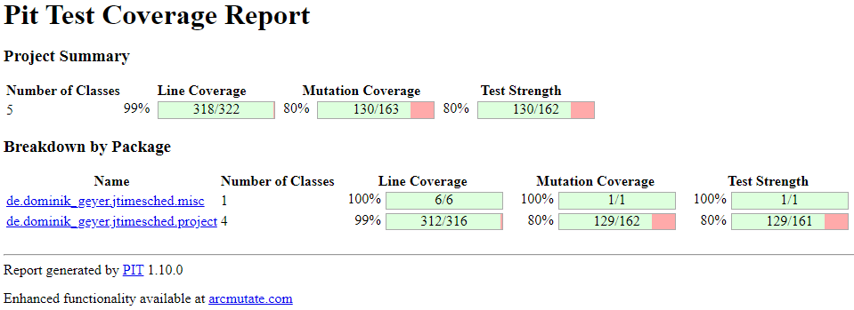

# Assignment 9 - Mutation Testing (White-box Testing)

*Mutation Testing* is a type of software testing in which certain source code statements are changed/mutated to check if the test cases can find source code errors.
Its goal is to ensure the quality of test cases in terms of robustness so that they should fail the mutated source code.
The changes made in the mutant program should be kept extremely small not to affect the program's overall objective.
A **mutation** is nothing but a single syntactic change that is made to the program statement.
If the tests fail, the **mutation** is killed; if your tests pass, the **mutation** survives.
The quality of the tests can be gauged from the percentage of **mutations** killed.

Mutants that cannot be killed are called **equivalent mutants**.
An **equivalent mutant** is a mutant that always behaves the same way as the original program.
If the mutant acts like the standard code, it will always give the same output as the original program for any given input.
This makes this mutant (which is the same program as the one under test) impossible to be killed by the tests.

To assess the robustness of our tests, we used the **Pitest** tool, a mutation testing system.
The first step we took was to configure **Pitest** in our project.
For this, we had to update the *JUnit jupiter* plugins version to 5.9.1 and the *maven-surefire-plugin* version to 3.0.0-M7, in addition to removing the *junit-platform-surefire-provider* plugin.
Then, we needed to add the **Pitest** plugin, including a dependency that would support **JUnit 5**.
Lastly, we had to exclude some test classes, namely the main and GUI classes, since it was not our goal to test them.

Upon setting up this tool, we executed an initial **mutation analysis** by running the command `mvn test-compile org.pitest:pitest-maven:mutationCoverage`.
After analyzing the results, we first identified the **equivalent mutants** and only then created more unit tests to kill the remaining mutants.
Both of these steps are described in the following sections.
Finally, this report ends with the execution of the final **mutation analysis** after we have developed these tests.

## 1) Initial Mutation Score

The first step consisted of performing an initial analysis of the mutation coverage derived from the tests developed in previous assignments.
This first score surprised us positively due to its relatively high values, as shown in the following image:

However, these values are justified because we have extensively tested the program throughout the project, using either black-box or white-box testing techniques.
Looking at the previous figure, we can see that several mutants were already killed by the tests performed in previous assignments.
The mutants that still need to be addressed are inside the `project` package, whose class breakdown can be better visualized in the following figure:

As we can see, the mutants that survived can be found in the classes `Project.java`, `ProjectSerializer.java` and `ProjectTableModel.java`.
This assignment aims to increase the mutation score of our tests, seeking to eliminate as many mutations as possible.

## 2) Equivalent Mutants

### In file `Project.java`

#### Lines 163 & 177

The first mutants we found consisted of removing calls to the `printStackTrace` method from exceptions thrown in the code.
These exceptions would only happen if there were an attempt to get the elapsed seconds of a project that is not running.
The mutants survived, as removing the calls did not affect the program's behaviour.
The leading cause of this is essentially due to the fact that this scenario never happens, as it is prevented by an `if` statement performed before calling the method that could throw them.
This verification ensures that no exception is thrown, so the statement at hand is never executed.

### In file `ProjectSerializer.java`

#### Line 63

This next mutant also consists of removing a method call, namely a method responsible for defining the number of spaces used in the indentation of the XML file to be written.
The fact that the mutant survives, despite correctly testing by reading the resulting XML, suggests that this call is not fundamental to the program.
We also noticed that the code contained an author comment with a link to a given bug in a bug database ([Bug Link/ID](http://bugs.sun.com/bugdatabase/view_bug.do?bug_id=6296446)).
After studying the subject, we concluded that, despite the default indentation value being already 4, the author was forced to make this function call due to the bug mentioned above, which is currently fixed.
Therefore, this call is dispensable, resulting in an **equivalent mutant**.

#### Line 67

This next mutant consisted of removing a call to a function that defines properties of the XML file to be written, more precisely, the type of encoding.
Since the defined value is the default value for reading the XML files, the presence of this function call also turns out to be unnecessary, thus resulting in an **equivalent mutant**.
(ENCODING default value = "encoding" = "UTF-8", sources = [Purpose](https://docs.oracle.com/javase/7/docs/api/javax/xml/transform/OutputKeys.html), [Default Values](https://docs.oracle.com/javase/7/docs/api/constant-values.html))

#### Lines 71 & 111

The following mutants also consist of removing function calls.
More specifically, the invoked functions serve to notify the start and end of a document, respectively.
However, both are optional, having no impact on the program's behaviour; hence these cases are considered **equivalent mutants**.
(source = [Purpose](https://docs.oracle.com/javase/7/docs/api/org/xml/sax/ContentHandler.html), [Optionality](https://stackoverflow.com/a/4267492))

#### Lines 87, 92 & 99

The following three mutants result from removing a call responsible for clearing the list of attributes for reuse, freeing up little memory.
Since this call does not affect the program's behaviour, serving only for memory management purposes, this case is an **equivalent mutant**.
(source = [Purpose](https://docs.oracle.com/javase/7/docs/api/org/xml/sax/helpers/AttributesImpl.html#clear()))

#### Lines 113 & 114

Similarly to the last mutants, these result from removing calls to functions related to memory management.
The first is responsible for flushing the stream, and the second is for closing it.
Thus, as they do not interfere with the program's behaviour, they constitute **equivalent mutants**.
(sources = [Flush](https://www.tutorialspoint.com/java/io/outputstreamwriter_flush.htm), [Close](https://www.tutorialspoint.com/java/io/outputstreamwriter_close.htm))

#### Line 193

The reason for this mutant is the same as the previous ones: removal of a call to a function, in this case, to *Java*'s print function.
Logically, this function has no interference with the program's output, so its presence is insignificant, thus resulting in an **equivalent mutant**.

## 3) Unit Tests

After identifying all equivalent mutants, we must develop new tests, or improve the existing ones, to kill the remaining mutants, increasing the mutation score.
This section describes these mutants and the tests implemented to kill them.

### In file `Project.java`

#### Lines 138 and 139

These mutants occur when the `+=` operator is changed for `-=`, replacing integer addition with subtraction, when updating the values of the `this.secondsOverall` and `this.secondsToday` variables inside the `pause` method.
Since the tests don't wait any time before pausing the project, the elapsed seconds were zero, so the result of these two operators was the same; therefore the mutants survived.

This occurs since the test `testPause_RunningProject_ShouldPause` implemented in previous assignments was only asserting that the project state became "paused", ignoring the changes made to the time variables.
Therefore, to kill this mutant, the following code lines were added to the test in the `ProjectTest.java` file:

By performing a delay of two seconds before pausing the project, we guarantee two elapsed seconds, leading to different results for the mentioned operators, which led to killing the mutants.

### In file `ProjectSerializer.java`

#### Line 69

This next mutant consisted of removing a call to a function that defines properties of the XML file to be written, more precisely, the presence of indentation.

To kill it, we verified the indentation of the XML file by checking the presence of four consecutive spaces in the `ProjectSerializerTest.java` file.
In the absence of the function call, the XML is written without any indentation, leading to test failure.

#### Line 74

This mutant removed a call to a version definition on the XML file.
Since this attribute was not tested in previous tests and did not affect the parsing of the XML file, the mutant survives.

To kill it, we verified the version property when creating an XML file in the `ProjectSerializerTest.java` file.

#### Line 95

This mutant consisted of removing a call to the creation of the XML element for the `quotaOverall` and `quotaToday` attributes in the `writeXML` method.
In previous assignments, we tested this method through the `testWriteXml_ProjectList_ShouldWriteAllProjects` test, which creates projects with new parameters, calls the `writeXML` method, and then verifies the XML file created.
However, we realized that we had forgotten to test two attributes from the project, the `QuotaOverall` and `QuotaToday` variables, allowing these mutants to survive.

Thus, to kill it, we added asserts for the missing parameters, in the `ProjectSerializerTest.java` file.

#### Line 146, 165, and 167

These mutants consisted of removing the call for three *set* methods after reading a project through the `readXML` method.
In previous assignments, we had tested this method through the `testReadXml_ProjectList_ShouldReadAllProjects` test, which creates projects with new parameters, writes them to an XML (through the `writeXML` method) and then calls the `readXML` method to verify that the values were properly read.
However, similarly to the last mutant, we realized that we had forgotten to test three attributes from the project, the `TimeStart`, `QuotaOverall` and `QuotaToday` variables, allowing these mutants to survive.

Thus, to kill them, we added the necessary parameters to different projects, in the `ProjectSerializerTest.java` file.
Afterwards, we compared the initial parameters to those read from the XML file, thus killing these three mutants.

### In file `ProjectTableModel.java`

#### Lines 160, 183, 187 and 205

These mutants consisted of the negation of conditionals, and a removed call, in the `setValueAt` method.
As these conditionals and this call only affect the messages printed in the logs, they do not affect the program's behaviour, so the mutants at hand survive.

Although not fundamental to the program, we decided to test the logging messages, killing these mutants.
For this, we check the number of logs and the printed message, in the `ProjectTableModelTest.java` file.

#### Line 192

This mutant consisted of removing a call to the `printStackTrace` method that is executed when an exception is raised.
This exception is thrown when trying to format a negative value of times.
The presence of the mentioned method ends up not influencing the behaviour of the program, as it only prints a description of the thrown exception; therefore the mutant survives.

Despite being of little relevance to the program, we decided to kill this mutant, in the `ProjectTableModelTest.java` file.
To kill it, we implemented a test using *Mockito* that mocked the exception and verified if the call to the given method was being made.

### Lines 210 and 218

These mutants consisted of removing the call to add and remove a project from the interface.
Additionally, in the first case, there are two other surviving mutants, which consist of replacing the two subtractions with additions.
The mutants survive because we need to verify the calls to these methods and whether they are called with the correct arguments.

We used a *spy* object to kill these mutants and verified that these methods were being called with the correct parameters, in the `ProjectTableModelTest.java` file.

## 4) Final Mutation Score

After performing mutation testing, we ended up with the following coverages:

Comparing these results with the initial report displayed on section 1, our:
- *Line Coverage* stayed at 99% (an already high value addressed in the previous assignments)
- *Mutation Coverage* increased from 80% to 93%
- *Test Strength* increased from 80% to 93%

Thus, we reached test coverage values above 90%, making the *jTimeSched* program more robust and error-free.
This coverage was increased by addressing the mutants inside the `project` package, whose final class breakdown can be visualized in the following figure:

The remaining mutants that prevented us from reaching 100% are *Equivalent Mutants* that can't be killed, thoroughly explained in the previous sections.

-----

## Group 10

- Hugo Guimarães, up201806490
- Paulo Ribeiro, up201806505

## Sources

- [Class Slides - Prof. José Campos](https://paginas.fe.up.pt/~jcmc/tvvs/2022-2023/lectures/lecture-8.pdf)
- [Mutation Testing - Guru99](https://www.guru99.com/mutation-testing.html)
- [Pitest - Pitest](http://pitest.org/)
- [Testing Logging - Effective Agile](https://effectiveagile.com/testing-and-handling-logging-in-java/)
- [Constant Values - Oracle](https://docs.oracle.com/javase/7/docs/api/constant-values.html)
- [OutputKeys - Oracle](https://docs.oracle.com/javase/7/docs/api/javax/xml/transform/OutputKeys.html)
- [AttributesImpl - Oracle](https://docs.oracle.com/javase/7/docs/api/org/xml/sax/helpers/AttributesImpl.html)
- [ContentHandler - Oracle](https://docs.oracle.com/javase/7/docs/api/org/xml/sax/ContentHandler.html)