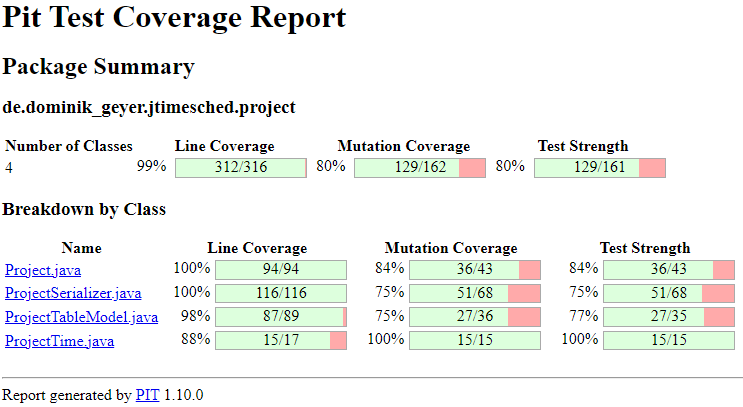

# Assignment 9 - Mutation Testing (White-box Testing)

*Mutation Testing* is a type of software testing in which certain statements of the source code are changed/mutated to check if the test cases are able to find source code errors.
Its goal is to ensure the quality of test cases in terms of robustness so that they should fail the mutated source code.
The changes made in the mutant program should be kept extremely small so that it does not affect the program's overall objective.
A **mutation** is nothing but a single syntactic change that is made to the program statement.
If the tests fail, the **mutation** is killed; if your tests pass, the **mutation** survives.
The quality of the tests can be gauged from the percentage of **mutations** killed.

Mutants that cannot be killed are called **equivalent mutants**.
An **equivalent mutant** is a mutant that always behaves the same way as the original program.
If the mutant behaves like the normal code, it will always give the same output as the original program for any given input.
Clearly, this makes this mutant (which is basically the same program as the one under test) impossible to be killed by the tests.

To assess the robustness of our tests, we used the **Pitest** tool, a mutation testing system.
The first step we took was to configure **Pitest** in our project.
For this, we had to update the *JUnit jupiter* plugins version to 5.9.1 and the *maven-surefire-plugin* version to 3.0.0-M7, in addition to removing the *junit-platform-surefire-provider* plugin.
Then, we needed to add the **Pitest** plugin, including a dependency that would support **JUnit 5**.
Lastly, we had to exclude some test classes, namely the main and GUI classes, since it was not our goal to test them.

Upon setting up this tool, we executed an initial **mutation analysis** by running the command `mvn test-compile org.pitest:pitest-maven:mutationCoverage`.
After analyzing the results, we first identified the **equivalent mutants** and only then created more unit tests to kill the remaining mutants.
Both of these steps are described in the following sections.
Finally, this report ends with the execution of the final **mutation analysis** after we have developed these tests.

## 1) Initial Mutation Score

// TODO: ("Analyze which mutants survive to your unit test cases and which parts of the source code has the most not-killed mutants") -> Isto não devia ser na secção dos equivalent mutants?

We first need to view our initial Pit Test Coverage report to start mutation testing.
Thus, we decided to exclude the tests associated with the GUI, done through the `pom.xml` file, resulting in the following coverage:

Since we performed extensive testing in previous assignments, either with black-box and white-box testing techniques, the initial *Pit Test Coverage Report* contains:

- Line Coverage - 99%
- Mutation Coverage - 80%
- Test Strength - 80%

Looking at the previous figure, we can see that several mutants were already "killed" by the tests performed in previous assignments.

The mutants that still need to be addressed are all inside the `jtimesched.project` directory, whose class breakdown can be better visualized in the following figure:

The goal of this assignment is to increase the scores of the report, covering all mutation cases.

## 2) Equivalent Mutants

// TODO: If any exists, list them here

Linha 163 -> Project.java
Linha 177 -> Project.java
Linha 185 -> Project.java
Linha 193 -> Project.java
Linha 201 -> Project.java

Linha 63 -> ProjectSerializer.java (bug já foi fixed, portanto ter aquela call ou não é igual)
Linha 67 -> ProjectSerializer.java (valor default de ENCODING já é "encoding", que é igual a "UTF-8")
Linha 69 -> ProjectSerializer.java (valor default de INDENT já é "indent", que é igual a "yes")
Linha 71 -> ProjectSerializer.java (startDocument é um unnecessary event - link stackoverflow?)
Linha 74 -> ProjectSerializer.java (não faz diferença no parsing, etc: "XML declaration contains details that prepare an XML processor to parse the XML document. It is optional, but when used, it must appear in the first line of the XML document." - https://www.tutorialspoint.com/xml/xml_declaration.htm)
Linha 87, 92, 99 -> ProjectSerializer.java (clear apenas liberta memória, não afeta comportamento do programa - https://docs.oracle.com/javase/7/docs/api/org/xml/sax/helpers/AttributesImpl.html#clear())
Linha 111 -> ProjectSerializer.java (endDocument é um unnecessary event - link stackoverflow?)
Linha 113 -> ProjectSerializer.java (flush apenas libera a stream, não afeta o comportamento do programa - https://www.tutorialspoint.com/java/io/outputstreamwriter_flush.htm)
Linha 114 -> ProjectSerializer.java (close apenas fecha a stream, não afeta o comportamento do programa - https://www.tutorialspoint.com/java/io/outputstreamwriter_close.htm - Therefore, if we forget to close the stream, the underlying channel will remain open and then we would end up with a resource leak - No, the topmost level Stream or reader will ensure that all underlying streams / readers are closed.)
Linha 193 -> ProjectSerializer.java (é apenas print na consola, pelo que não afeta o comportamento do programa)
Linha 204 -> ProjectSerializer.java (quando attributes é null, por default é considerado como um AttributesImpl vazio - If there are no attributes, it shall be an empty Attributes object - https://docs.oracle.com/javase/7/docs/api/org/xml/sax/ContentHandler.html#startElement(java.lang.String,%20java.lang.String,%20java.lang.String,%20org.xml.sax.Attributes))

// TODO: ProjectTableModel.java -> estas serão Equivalent? A 205 foi corrigida... (linhas 210, 218)

## 3) Unit Tests

// TODO: Brief description of test cases developed to increase project’s mutation score.

Project.java -> matamos aqueles 2 mutantes dos times

ProjectSerializer.java -> matamos o mutante das quotas no writeXML (linha 95)
ProjectSerializer.java -> matamos o mutante do time started (linha 146)
ProjectSerializer.java -> matamos o mutante do quota overall e quota today (linha 165, 167)

ProjectTableModel.java -> matamos o mutante ao adicionar testes ao logger (linha 160, 183, 187, 205 -> este acho que é killed porque notifica os listeners, que envolvem logs)
ProjectTableModel.java -> matamos o mutante ao adicionar teste que verifica se o printstackstrace foi printed (linha 191, 192)

// TODO: ProjectTime.java -> o construtor private não deve ser para testar, certo?

## 4) Final Mutation Score

// TODO: descrever score final de Mutation

After performing mutation testing, we ended up with the following code coverage:

// TODO: Add the final score image

Therefore, we were able to improve:
- *Line Coverage* from 99% to &&%
- *Mutation Coverage* from 80% to &&%
- *Test Strength* from 80% to &&%

Thus, we reached test coverage values above &&%, making the *JTimeSched* program more robust and error-free.

The remaining score that prevented us from reaching 100% is associated with the Equivalent Mutants that can't be killed, which were thoroughly explained in section 2 of the assignment.

-----

## Group 10

- Hugo Guimarães, up201806490
- Paulo Ribeiro, up201806505

## Sources

- [Class Slides - Prof. José Campos](https://paginas.fe.up.pt/~jcmc/tvvs/2022-2023/lectures/lecture-8.pdf)
- [Mutation Testing - Guru99](https://www.guru99.com/mutation-testing.html)
- [Pitest - Pitest](http://pitest.org/)